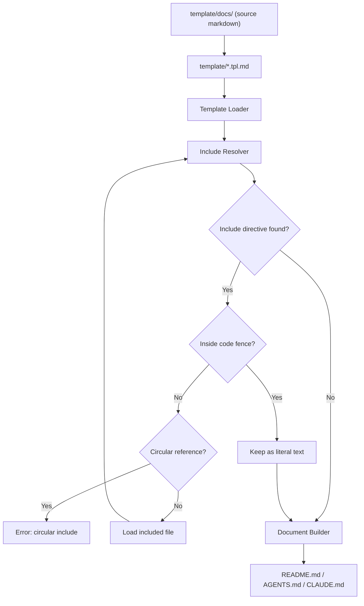
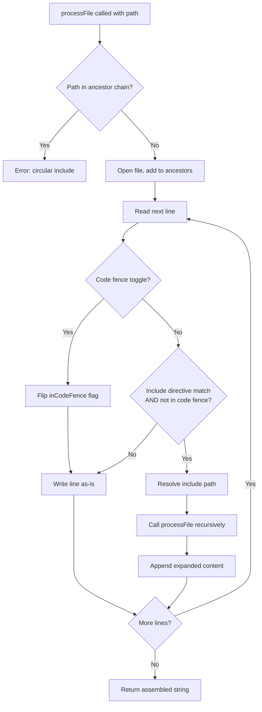

<!--
⚠️ AUTO-GENERATED FILE — DO NOT EDIT - template/ai-agents/codex/AGENTS.tpl.md
-->
# Project Context

## Overview

`docs-ssot` is a documentation Single Source of Truth (SSOT) generator.

It composes files such as README.md, CLAUDE.md, AGENTS.md, and other AI agent instruction files from small modular Markdown files.

---

## Background

AI-assisted development and AI agents are becoming a standard part of software development workflows.  
Different AI tools and agents require different instruction and context files, for example:

- README.md
- AGENTS.md
- CLAUDE.md
- Agent-specific rule files like `.claude/rules`, `.cursor/rules`
- Development guidelines
- Architecture documentation

As the number of AI tools increases (Claude, Codex, Cursor, etc.), maintaining these files becomes difficult.

Common problems include:

- Documentation duplication
- Inconsistent information across files
- Outdated documentation
- Manual copy & paste maintenance
- Documentation drift over time

Maintaining multiple documentation files without duplication becomes increasingly difficult.

---

## Problem

Documentation should follow the Single Source of Truth (SSOT) principle, but Markdown alone has limited reuse and composition capabilities.

Markdown is easy to write but lacks:

- File composition
- Reusable documentation modules
- Document templating
- Shared sections across multiple documents
- Structured documentation assembly

As a result, teams often duplicate content across multiple Markdown files.

---

## Solution

`docs-ssot` solves this problem by introducing:

- Modular Markdown documentation
- Template-based document structure
- Include directives for Markdown files
- Generated documentation files
- Single Source of Truth documentation architecture

Instead of writing large README files directly, documentation is split into small reusable Markdown modules and assembled into final documents using templates.

---

## Concept

The documentation workflow changes from this:

```
Manually write:

- README.md
- AGENTS.md
- CLAUDE.md
```

To this:

```
Write small docs in docs/
  ↓
Use templates
  ↓
docs-ssot build
  ↓
Generate README.md / AGENTS.md / CLAUDE.md
```

This ensures:

- No duplication
- Consistent documentation
- Easier updates
- Scalable documentation structure
- AI-friendly documentation organization

---

## SSOT Rules for AI Agents

This repository uses `docs-ssot`, a documentation Single Source of Truth generator.

All documentation is written as small modular Markdown files under `template/docs/`.
Final documents (`README.md`, `CLAUDE.md`, `AGENTS.md`) are **generated build artifacts**.

### Critical Rules

- **Never edit** `README.md`, `CLAUDE.md`, or `AGENTS.md` directly — they are overwritten on every build
- **Edit source files** under `template/docs/` instead
- **Edit templates** under `template/*.tpl.md` to change document structure
- After editing, run `make docs` to regenerate output

### Build Pipeline

```
template/docs/**/*.md  →  template/*.tpl.md  →  docs-ssot build  →  README.md / CLAUDE.md / AGENTS.md
```

### Include Directive

Templates and source files use include directives to compose content:

```markdown
<!-- @include: docs/01_project/overview.md -->
<!-- @include: docs/02_product/ -->
<!-- @include: docs/**/*.md level=+1 -->
```

Includes are resolved recursively. Circular includes cause a build error.

---

# Repository Structure

## Directory Structure

```
docs-ssot/
├── cmd/docs-ssot/main.go       # CLI entry point
├── internal/
│   ├── cli/                    # Cobra subcommands (build, check, include, validate, version)
│   ├── config/config.go        # YAML config loader (docsgen.yaml)
│   ├── dupcheck/               # Near-duplicate section detector (TF-IDF cosine similarity)
│   ├── generator/generator.go  # Build orchestrator (Build, Validate)
│   └── processor/              # Include resolver + content transformers
│       ├── processor.go        # Core: ProcessFile, include resolution, glob/directory support
│       ├── heading.go          # HeadingTransformer: level=±N adjustment
│       ├── link.go             # LinkTransformer: relative path rewriting
│       └── transformer.go      # Transformer interface and Apply function
├── template/
│   ├── docs/                   # Source Markdown files (SSOT — edit here)
│   │   ├── 01_project/         # Project overview, vision, roadmap
│   │   ├── 02_product/         # Product concept and features
│   │   ├── 03_architecture/    # System architecture, pipeline, diagrams
│   │   ├── 04_development/     # Setup, testing, linting guides
│   │   ├── 05_ai/              # AI agent context and rules
│   │   └── 06_reference/       # Commands and directory reference
│   ├── README.tpl.md           # Template for README.md
│   ├── CLAUDE.tpl.md           # Template for CLAUDE.md
│   └── AGENTS.tpl.md           # Template for AGENTS.md
├── docsgen.yaml                # Build targets: template → output mapping
├── Makefile                    # Build, lint, test, docs commands
├── .golangci.yml               # Linting configuration (46+ linters)
├── .goreleaser.yaml            # Release automation
└── lefthook.yml                # Git hooks (pre-commit, pre-push)
```

### Generated Files (do not edit)

- `README.md` — generated from `template/README.tpl.md`
- `CLAUDE.md` — generated from `template/CLAUDE.tpl.md`
- `AGENTS.md` — generated from `template/AGENTS.tpl.md`

---

# Architecture

## Architecture Overview

The system consists of:

- Generator CLI
- Markdown modules
- Template files

## System Architecture

`docs-ssot` is composed of three main layers:

1. Generator CLI (docs-ssot)
2. Markdown source files (docs/)
3. Template files (template/)

The generator reads template files, resolves include directives, and produces final documents such as `README.md` and `AGENTS.md`, `CLAUDE.md`.

---

### `docs-ssot` CLI Core Components

Internally, the generator is intentionally simple and built around three core components:

#### 1. Template Loader

Responsible for loading template files.

- Reads template files from the template directory
- Provides template content to the include resolver

Templates define the structure of generated documents.

---

#### 2. Include Resolver

Responsible for resolving include directives.

- Parses include directives
- Loads referenced Markdown files
- Expands includes recursively
- Supports directory and glob includes
- Detects circular includes
- Returns fully expanded Markdown content

This is the core component of the system.

#### 3. Link Path Rewriter

Responsible for rewriting relative links and image URLs in processed files.

- Adjusts link paths to be correct relative to the output file location
- Handles both Markdown links and image references
- Ensures links work regardless of source file depth

---

#### 4. Document Builder

Responsible for generating final output files.

- Receives expanded Markdown content
- Assembles the final document
- Writes output files (e.g., README.md, AGENTS.md, CLAUDE.md)
- Ensures deterministic output

---

### Components

### docs/

The docs directory contains the Single Source of Truth Markdown files.
Each file represents a small, reusable piece of documentation.

These files should:

- be small
- be reusable
- contain only one topic
- not depend on document structure

---

### template/

Template files define document structure.

They do not contain actual documentation content, only structure and include directives.

Examples:

- README.tpl.md
- CLAUDE.tpl.md

Templates decide:

- document order
- document sections
- which content appears in which output

---

### Generator (docs-ssot)

The generator is a CLI tool that orchestrates the core components:

1. Load template (Template Loader)
2. Resolve includes (Include Resolver)
3. Write output (Document Builder)

### `docsgen.yaml` Config file

Configuration for input file and output file.

```yaml
targets:
  - input: template/README.tpl.md
    output: README.md

  - input: template/AGENTS.tpl.md
    output: AGENTS.md

  - input: template/CLAUDE.tpl.md
    output: CLAUDE.md
```

---

## Document Build Flow

The document generation flow works like this:



---

### Design Principles

The system is designed with the following principles:

- Single Source of Truth
- Modular documentation
- Template-based composition
- Generated outputs
- Documentation as code
- Deterministic builds
- Simple implementation
- No heavy static site generator

---

### Design Philosophy

`docs-ssot` is intentionally minimal.

Instead of implementing a full template engine, the system performs only four operations:

1. Load templates
2. Expand includes (with heading level adjustment)
3. Rewrite relative link paths
4. Write documents

Everything else is handled through Markdown structure and file organization.

---

# Include Specification

This document defines the include directive specification used by `docs-ssot`.

## Overview

The include directive allows Markdown files and templates to include other Markdown files.
Includes are expanded recursively to build final generated documents.

---

## Include Directive Syntax

```
<!-- @include: path [level=<delta>] -->
```

Example:

```
<!-- @include: docs/01_project/overview.md -->
```

The directive must be written inside an HTML comment.

An optional `level` parameter adjusts the heading depth of the included content:

```
<!-- @include: docs/03_architecture/overview.md level=+1 -->
<!-- @include: docs/03_architecture/overview.md level=-1 -->
<!-- @include: docs/03_architecture/overview.md level=+2 -->
```

| Parameter | Meaning |
|-----------|---------|
| `level=+1` | Deepen all headings by one level (`##` → `###`) |
| `level=+2` | Deepen all headings by two levels (`##` → `####`) |
| `level=-1` | Shallow all headings by one level (`###` → `##`) |
| `level=0` | No change (same as omitting the parameter) |

Heading levels are clamped to the valid range `[1, 6]`.
Headings inside fenced code blocks in the included file are not adjusted.

---

## Supported Include Paths

The include directive supports multiple path formats.

### 1. Single File Include

```
<!-- @include: docs/01_project/overview.md -->
```

Includes a single Markdown file.

### 2. Directory Include

```
<!-- @include: docs/02_product/ -->
```

Includes all `.md` files in the directory (non-recursive).
Files are included in sorted filename order.
The trailing `/` in the path is required to trigger directory mode.
Subdirectories are skipped; only `.md` files directly in the specified directory are included.

### 3. Glob Include

```
<!-- @include: docs/02_product/*.md -->
```

Includes all files matching the glob pattern.
Files are included in sorted (lexical) order.
Glob metacharacters (`*`, `?`, `[`) in the path trigger glob mode.
If the pattern matches no files, no content is inserted (no error).
Subdirectories matched by the pattern are skipped; only regular files are included.

---

### 4. Recursive Glob Include

```
<!-- @include: docs/**/*.md -->
```

Includes all files matching the recursive glob pattern.
`**` matches zero or more path segments, so `docs/**/*.md` matches both `docs/file.md` and `docs/sub/deep/file.md`.
Files are included in sorted (lexical) path order.
If the root directory does not exist or no files match, no content is inserted (no error).
Directories are skipped; only regular files are included.

---

## Include Order

When including multiple files (directory or glob), files are included in alphabetical order.

Recommended file naming:

```
01_overview.md
02_features.md
03_usecases.md
```

This ensures deterministic document structure.

---

## Recursive Includes

Included files may contain include directives themselves.

Example:

```
A.md includes B.md
B.md includes C.md
```

Final expanded document:

```
A + B + C
```

The system expands includes recursively until no include directives remain.

The algorithm used for recursive resolution:



---

## Circular Include Detection

Circular includes are detected and treated as errors.

Example:

```
A.md includes B.md
B.md includes C.md
C.md includes A.md
```

This must result in an error.

---

## Missing File Handling

If an included file does not exist, the generator must return an error and stop the build.

Includes must not fail silently.

---

## Path Rules

- Paths are resolved relative to the file containing the directive
- Only `.md` files can be included
- Include directives must be on their own line
- Includes are expanded before document generation

---

## Summary

Supported include formats:

| Format | Description |
|-------|-------------|
| file.md | Single file |
| dir/ | All markdown files in directory |
| *.md | Glob include |
| **/*.md | Recursive glob include |

Rules:

- Includes are expanded recursively
- Files are included in sorted order
- Circular includes are errors
- Missing files are errors
- Only Markdown files can be included

---

# Development Guide

## Setup

### Prerequisites

- Go 1.26+
- make

### Install

```sh
go install github.com/hiromaily/docs-ssot/cmd/docs-ssot@latest
```

Or build from source:

```sh
git clone https://github.com/hiromaily/docs-ssot.git
cd docs-ssot
make build
```

The binary is output to `bin/docs-ssot`.

### Quick Start

1. Create source Markdown files under `template/docs/`
2. Create template files under `template/` (e.g., `README.tpl.md`)
3. Define build targets in `docsgen.yaml`:

```yaml
targets:
  - input: template/README.tpl.md
    output: README.md
```

4. Generate documents:

```sh
docs-ssot build
```

### Development Setup

```sh
make install-dev   # Install lefthook and golangci-lint
make build         # Build the binary
make docs          # Generate documentation
make test          # Run tests
```

## Testing

This document describes the testing strategy for docs-ssot.

### Overview

The project includes tests for the documentation generator, include resolver, and pipeline processing.

Testing ensures that documentation generation is deterministic, correct, and safe from issues such as missing includes or circular references.

---

### What We Test

The following components should be tested:

### Include Resolver

- Include directive parsing
- File loading
- Recursive includes
- Circular include detection
- Missing file errors

### Template Processing

- Template loading
- Include expansion inside templates
- Final document assembly

### Pipeline

- End-to-end document generation
- README generation
- AGENTS.md, CLAUDE.md generation
- Multiple template builds

---

### Test Types

### Unit Tests

Unit tests should cover:

- Include parsing
- Path resolution
- Circular include detection
- File loading logic
- Markdown merging

### Integration Tests

Integration tests should:

- Run the generator on a test docs directory
- Generate README.md
- Compare output with expected files

Example flow:

```
testdata/
docs/
template/
expected/
```

Test steps:

1. Run generator
2. Generate README.md
3. Compare with expected/README.md
4. Test should fail if output differs

---

### Example Test Cases

### Include Resolver

* Include single file
* Include nested files
* Include multiple files
* Missing file error
* Circular include error

### Generator

* Generate README from template
* Generate CLAUDE from template
* Multiple includes in template
* Nested includes
* Empty include file

---

### Deterministic Output

Generated documents must always be deterministic:

* Same input → same output
* No timestamps in generated files
* No random ordering
* Stable include order

This is important for Git diffs and CI.

---

### CI Testing

Tests should run in CI on every pull request.

Typical CI steps:

```sh
go test ./...
docs-ssot build
git diff --exit-code README.md
```

This ensures that generated files are always up to date.

---

### Recommended Test Command

```sh
make test
```

Example Makefile:

```makefile
test:
	go test ./...

test-e2e:
	docs-ssot build
	git diff --exit-code
```

## Linting

This project uses `golangci-lint` (v2) with 46+ linters enabled.

The linter is pinned as a Go tool dependency and invoked via `go tool golangci-lint`.

### Commands

| Command | Description |
|---------|-------------|
| `make go-lint` | Lint and auto-fix |
| `make go-lint-check` | Lint check only (no fix) |
| `make go-lint-fast` | Fast linters only with auto-fix |
| `make go-fmt` | Format all Go files with gofumpt |

### Key Rules

- **Max line length**: 200 characters
- **Max cyclomatic complexity**: 16
- **Formatting**: gofumpt (stricter than gofmt)

### Git Hooks (lefthook)

| Hook | Command | Trigger |
|------|---------|---------|
| `pre-commit` | `make go-fmt` | `*.go` files staged |
| `pre-push` | `make go-lint` | `*.go` files pushed |

Run `make install-dev` to set up hooks.

---

# Commands Reference

This document describes the available CLI commands for docs-ssot.

## Overview

The CLI provides commands for generating documents from templates and managing documentation sources.

| Command | Description |
|---------|-------------|
| `docs-ssot build` | Generate final documents from templates |
| `docs-ssot check` | Check docs for SSOT violations by detecting near-duplicate sections |
| `docs-ssot include <file>` | Resolve includes and print expanded result to stdout |
| `docs-ssot migrate [files...]` | Decompose existing Markdown files into SSOT section structure |
| `docs-ssot migrate --from <tool>` | Migrate AI tool configs from one tool to others |
| `docs-ssot validate` | Validate documentation structure without generating output |
| `docs-ssot version` | Print the build version |

---

## docs build

Generate final documents (e.g., README.md, CLAUDE.md) from templates.

```
docs-ssot build
```

### What it does

- Reads template files
- Resolves `@include` directives
- Expands included Markdown files
- Writes final generated documents

---

## docs check

Check docs for SSOT violations by detecting near-duplicate sections across Markdown files.

```
docs-ssot check [flags]
```

Uses TF-IDF cosine similarity to compare sections at the specified heading level. Sections scoring above the threshold are reported as potential SSOT violations — places where the same information exists in multiple source files.

### Flags

| Flag | Default | Description |
|------|---------|-------------|
| `--root` | `docs` | Root directory to scan for Markdown files |
| `--threshold` | `0.82` | Similarity cutoff (0.0–1.0); pairs above this score are reported |
| `--min-chars` | `120` | Minimum character count for a section to be included in comparison |
| `--section-level` | `2` | Heading level used as section boundary (1–6) |
| `--format` | `text` | Output format: `text` or `json` |
| `--exclude` | — | Exclude path pattern (repeatable) |

### Examples

Basic check with default settings:

```
docs-ssot check
```

Lower threshold to catch more candidates:

```
docs-ssot check --threshold 0.75
```

Compare at H3 level, exclude changelogs, output JSON:

```
docs-ssot check --section-level 3 --exclude docs/changelog/** --format json
```

### Output

Text output (one block per similar pair):

```
score=0.891
A: docs/auth/overview.md [API > Authentication]
B: docs/setup/login.md [Setup > Authentication]
A title: Authentication
B title: Authentication
A snippet: Authentication tokens must be refreshed before they expire...
B snippet: Access tokens must be renewed prior to expiry...
----------------------------------------------------------------------------------------------------
```

A score of `1.0` means identical content; `0.82` (default threshold) catches near-duplicates while filtering loosely related content.

### Exit behaviour

Exits `0` whether or not duplicates are found. Use `--format json` and inspect `result_count` in CI pipelines.

---

## docs migrate

Decompose existing monolithic Markdown files (e.g., README.md, CLAUDE.md) into the docs-ssot section structure.

```
docs-ssot migrate [files...] [flags]
```

This is the primary adoption command. It takes existing documentation files and converts them into modular, reusable sections with template files that reproduce the original document structure via `@include` directives.

### What it does

1. **Splits** each input file by H2 headings into candidate sections
2. **Categorises** sections into directories (`project/`, `development/`, `architecture/`, `reference/`, `product/`, `misc/`) based on heading keyword heuristics
3. **Detects duplicates** across input files using TF-IDF cosine similarity (reuses the `check` command's engine)
4. **Creates section files** under `template/sections/<category>/<slug>.md`
5. **Creates template files** under `template/pages/<name>.tpl.md` with `@include` directives
6. **Creates `docsgen.yaml`** if it does not already exist
7. **Verifies round-trip** by running `build` and comparing output against originals

### Section categorisation

Sections are assigned to categories based on heading keywords:

| Heading keywords | Category |
|-----------------|----------|
| Architecture, Design, System, Pipeline | `architecture/` |
| Overview, About, Introduction, Background | `project/` |
| Install, Setup, Getting Started, Prerequisites | `development/` |
| Test, Testing, CI | `development/` |
| Lint, Format, Code Quality | `development/` |
| Contributing, Contribute | `development/` |
| API, Commands, CLI, Reference | `reference/` |
| License, Changelog, Roadmap | `project/` |
| FAQ, Troubleshooting | `product/` |
| (fallback) | `misc/` |

### Duplicate handling

When the same content appears in multiple input files:

1. TF-IDF cosine similarity is computed between all cross-file section pairs
2. Pairs scoring above the threshold are merged into a single section file
3. Both templates reference the shared section via `@include`

### Flags

| Flag | Default | Description |
|------|---------|-------------|
| `--output-dir` | `template/sections` | Where to write section files |
| `--template-dir` | `template/pages` | Where to write template files |
| `--section-level` | `2` | Heading level used as section boundary (1–6) |
| `--threshold` | `0.82` | Similarity threshold for duplicate detection (0.0–1.0) |
| `--dry-run` | `false` | Print the migration plan without writing files |

### Examples

Migrate existing README and CLAUDE.md:

```
docs-ssot migrate README.md CLAUDE.md
```

Preview migration plan without writing files:

```
docs-ssot migrate --dry-run README.md CLAUDE.md
```

Lower the duplicate detection threshold:

```
docs-ssot migrate --threshold 0.75 README.md
```

Split at H1 boundaries instead of H2:

```
docs-ssot migrate --section-level 1 README.md
```

### Output

```
Parsed README.md: 8 sections
Parsed CLAUDE.md: 6 sections
Detected 3 duplicate sections (similarity > 0.82):
  "Architecture Overview" — merged into template/sections/architecture/overview.md (score=0.950)
  "Setup" — merged into template/sections/development/setup.md (score=1.000)
  "Testing" — merged into template/sections/development/testing.md (score=0.891)
Creating 11 unique section files in template/sections
  template/sections/project/overview.md
  template/sections/development/setup.md
  ...
Created template/pages/README.tpl.md (8 includes)
Created template/pages/CLAUDE.tpl.md (6 includes)
Created docsgen.yaml
Verifying round-trip...
Round-trip verification: OK
Migration complete.
```

### Post-migration workflow

After `migrate`, the user's workflow becomes:

```sh
# Edit source sections
vim template/sections/development/setup.md

# Regenerate all outputs
docs-ssot build

# Verify
git diff README.md CLAUDE.md
```

---

### Agent-aware migration (`--from`)

With `--from`, `migrate` scans AI tool configuration files (rules, skills, commands, subagents) from the specified tool and generates SSOT sections with per-tool templates for the target tools.

```
docs-ssot migrate --from <tool> [--to <tools>] [flags]
```

#### What it does

1. **Scans** the source tool's configuration directory for rules, skills, commands, and subagents
2. **Strips** frontmatter from source files and shifts H1→H2 headings
3. **Creates section files** under `template/sections/ai/<type>/<slug>.md`
4. **Generates templates** for each target tool with appropriate frontmatter
5. **Updates `docsgen.yaml`** with new build targets
6. **Verifies round-trip** by building and comparing against originals

#### Flags

| Flag | Default | Description |
|------|---------|-------------|
| `--from` | (required) | Source AI tool to migrate from (`claude`, `cursor`, `copilot`) |
| `--to` | all except `--from` | Target tools, comma-separated (`cursor,copilot,codex`) |
| `--convert-commands` | `false` | Convert legacy commands to skills during migration |
| `--infer-globs` | `false` | Infer path-gated globs from rule slug names |
| `--dry-run` | `false` | Print the migration plan without writing files |

#### Examples

Migrate Claude configs to all other tools:

```
docs-ssot migrate --from claude
```

Migrate to specific tools only:

```
docs-ssot migrate --from claude --to cursor,codex
```

Preview migration plan:

```
docs-ssot migrate --from claude --dry-run
```

Migrate with path inference and command conversion:

```
docs-ssot migrate --from claude --to cursor --infer-globs --convert-commands
```

Combine agent and file migration:

```
docs-ssot migrate --from claude --to cursor README.md CLAUDE.md
```

#### Output

```
Detected source tool: claude (5 files)
Target tools: cursor, copilot, codex

Creating sections:
  template/sections/ai/rules/architecture.md
  template/sections/ai/rules/testing.md
  template/sections/ai/skills/deploy.md
  template/sections/ai/subagents/critic.md
  template/sections/ai/subagents/debugger.md

Creating templates (3 tools × 5 files):
  cursor: 5 templates
  copilot: 5 templates
  codex: 4 templates

Updated docsgen.yaml (14 new targets)
Verifying round-trip...
Round-trip verification: OK
Agent migration complete.
```

---

## docs include

Resolve include directives and print the expanded result to stdout.

```
docs-ssot include <file>
```

Example:

```
docs-ssot include template/README.tpl.md
```

Useful for debugging template expansion without writing any output files.

---

## docs validate

Validate documentation structure without generating any output files.

```
docs-ssot validate
```

Performs a dry run over all templates in `docsgen.yaml`.

### Validation checks

- Missing include files
- Circular includes
- Invalid paths

### Output

Success:

```
OK
```

Failure (one line per failing template):

```
ERROR: include error (/path/to/file.md): open /path/to/file.md: no such file or directory
```

Exits with a non-zero status code when any error is found.

---

## docs version

Print the build version.

```
docs-ssot version
```

---

## Typical Workflow

```
docs-ssot validate
docs-ssot build
```

Or during development:

```
docs-ssot include template/README.tpl.md
```

---

## Recommended Makefile Shortcuts

```
make docs                                     # generate all output targets
make docs-validate                            # validate all templates
make docs-include FILE=template/README.tpl.md # expand and print a template
make docs-check                               # check docs for SSOT violations (default settings)
make docs-check ARGS="--threshold 0.75"       # check with custom flags
make docs-migrate FILES="README.md CLAUDE.md" # migrate existing docs to SSOT structure
make docs-migrate FILES="README.md" ARGS="--dry-run"  # preview migration plan
make docs-migrate-from FROM=claude             # migrate Claude configs to all other tools
make docs-migrate-from FROM=claude TO=cursor   # migrate Claude to Cursor only
make docs-version                             # print the build version
```

---

# Development Rules

## General Development Rules for docs-ssot

### Project Purpose

`docs-ssot` is a CLI tool that generates documentation files (README.md, CLAUDE.md, AGENTS.md) from modular Markdown source files using a template-based composition system. It implements the Single Source of Truth (SSOT) principle for documentation.

---

### Critical Rule: Never Edit Generated Files

The following files are **build artifacts** — do NOT edit them directly:

- `README.md`
- `CLAUDE.md`
- `AGENTS.md`

Always edit the source files in `docs/` and regenerate with `make docs`.

---

### Repository Structure

```
docs-ssot/
├── cmd/docs-ssot/main.go       # CLI entry point (build command)
├── internal/
│   ├── config/config.go        # YAML config loader (Config, Target types)
│   ├── generator/generator.go  # Build orchestrator (Build func)
│   └── processor/              # Include resolver + transformer pipeline (ProcessFile func)
├── docs/                       # Source Markdown files (SSOT — edit here)
│   ├── 01_project/             # Project context and vision
│   ├── 02_product/             # Product concept and features
│   ├── 03_architecture/        # System architecture and pipeline
│   ├── 04_development/         # Setup, testing, linting guides
│   ├── 05_ai/                  # AI tool-specific docs (Claude, Cursor, Codex, etc.)
│   └── 06_reference/           # Commands and directory reference
├── template/                   # Document templates (define output structure)
│   ├── README.tpl.md
│   ├── CLAUDE.tpl.md
│   └── AGENTS.tpl.md
├── docsgen.yaml                # Build targets: template → output mapping
├── Makefile                    # Build, lint, test, docs commands
└── .golangci.yml               # Linting configuration (46+ linters)
```

---

### Go Package Responsibilities

| Package | File | Responsibility |
|---|---|---|
| `main` | `cmd/docs-ssot/main.go` | CLI arg parsing, dispatch to `generator.Build()` |
| `config` | `internal/config/config.go` | Load/save `docsgen.yaml` into `Config{Targets []Target}` |
| `generator` | `internal/generator/generator.go` | Iterate targets, call include resolver, write output |
| `processor` | `internal/processor/processor.go` | Include resolution, transformer pipeline (ProcessFile, Transformer, Apply) |
| `agentscan` | `internal/agentscan/agentscan.go` | Detect AI tools (.claude/, .cursor/, .github/, .codex/) and collect agent files |
| `frontmatter` | `internal/frontmatter/frontmatter.go` | Parse/strip/generate YAML frontmatter for different tool formats |
| `migrate` | `internal/migrate/agents.go` | Agent-aware migration pipeline (scan → section → template → config → verify) |

#### Include Directive Pattern

```go
var includePattern = regexp.MustCompile(`^\s*<!--\s*@include:\s*(.*?)\s*-->\s*$`)
```

In Markdown, the directive looks like:

```markdown
<!-- @include: docs/01_project/overview.md -->
<!-- @include: docs/01_project/overview.md level=+1 -->
<!-- @include: docs/01_project/overview.md level=-1 -->
<!-- @include: docs/02_product/ -->
<!-- @include: docs/02_product/ level=+1 -->
<!-- @include: docs/02_product/*.md -->
<!-- @include: docs/02_product/*.md level=+1 -->
<!-- @include: docs/**/*.md -->
<!-- @include: docs/**/*.md level=+1 -->
```

The optional `level=±N` parameter shifts all ATX heading levels in the included content by N (clamped to `[1, 6]`). Headings inside code fences are not adjusted.

When the path ends with `/`, all `.md` files in that directory are included in sorted filename order (subdirectories are skipped). Combine with `level=±N` to adjust heading depths for the entire directory's content.

When the path contains `**`, all files matching the recursive glob pattern are included in sorted (lexical) path order. `**` matches zero or more path segments. If the root directory does not exist or no files match, no content is inserted (no error).

When the path contains glob metacharacters (`*`, `?`, `[`) but not `**`, all files matching the pattern are included in sorted (lexical) order. Directories matched by the pattern are skipped. If no files match, no content is inserted (no error).

`ProcessFile()` reads the template line-by-line, replaces include directives with file contents (applying heading adjustment if specified), and returns the assembled string.

---

### Build Pipeline

```
docsgen.yaml
  → config.Load()
  → for each target: include.ProcessFile(template)
  → os.WriteFile(output)
```

Recursive expansion is supported: included files may themselves contain include directives, resolved depth-first with circular reference detection.

---

### Common Commands

```sh
make build          # Compile: go build -o bin/docs-ssot ./cmd/docs-ssot
make docs           # Generate docs: go run ./cmd/docs-ssot build
make go-test        # Run tests: go test ./...
make go-lint        # Lint and auto-fix: golangci-lint run --fix
make go-lint-check  # Lint check only (no fix)
make go-fmt         # Format: golangci-lint fmt
make run            # go run ./cmd/docs-ssot build
make clean          # Remove bin/ and generated README.md, CLAUDE.md
```

---

### How to Add New Documentation

1. Create a new `.md` file in the appropriate `docs/` subdirectory.
2. Add an include directive where needed in the relevant `template/*.tpl.md` file:
   ```markdown
   <!-- @include: docs/04_development/new-guide.md -->
   ```
3. Run `make docs` to regenerate output files.
4. Commit both the source file and the regenerated output.

---

### How to Add a New Output Target

1. Create a new template file in `template/`, e.g., `template/MYFILE.tpl.md`.
2. Add a new entry in `docsgen.yaml`:
   ```yaml
   - input: template/MYFILE.tpl.md
     output: MYFILE.md
   ```
3. Run `make docs`.

---

### Current Limitations (Planned for Future)
- **No variable substitution**: No `{{ variable }}` placeholder support.

When implementing include-related features, the primary file to modify is `internal/processor/processor.go`.
To add a new content transformation, implement the `Transformer` interface in `internal/processor/` and register it in the relevant processing step.

---

### Code Quality Requirements

- **Go version**: 1.26.1
- **Linter**: `golangci-lint` via `go tool golangci-lint` (configured in `.golangci.yml`)
- **Active linters**: 46+ including `govet`, `staticcheck`, `gosec`, `errcheck`, `gofumpt`, `goimports`
- **Max line length**: 200 chars
- **Max cyclomatic complexity**: 16
- **Formatting**: `gofumpt` (stricter than `gofmt`)
- Always run `make go-lint` before committing Go changes.

---

### Testing Strategy

- Unit tests: cover include parsing, path resolution, circular detection, file loading.
- Integration tests: run generator on `testdata/`, compare output with `expected/` fixtures.
- Deterministic output required: same input must always produce same output.

After implementing features, verify with:

```sh
make go-test
make docs
git diff --exit-code README.md CLAUDE.md AGENTS.md
```

---

### Module Info

- **Module path**: `github.com/hiromaily/docs-ssot`
- **Key dependency**: `gopkg.in/yaml.v3` for YAML config parsing
- **Linting tools**: bundled as Go tool dependencies in `go.mod`

## Documentation Rules for docs-ssot

### SSOT Principle: Only Edit Source Files

This project generates documentation from source files. The pipeline is:

```
template/docs/**/*.md  +  template/*.tpl.md  +  docsgen.yaml
                          ↓
              docs-ssot build (make docs)
                          ↓
          README.md / AGENTS.md / CLAUDE.md
```

#### Generated Files — Never Edit Directly

The following are **build artifacts** and must NOT be modified:

- `README.md`
- `AGENTS.md`
- `CLAUDE.md`

If you need to change content in these files, find the source file under `docs/` that contains that section and edit it there, then run `make docs`.

---

### Source Files — Where to Make Changes

All documentation content lives under `docs/`. Edit files here:

| Directory | Purpose |
|---|---|
| `docs/01_project/` | Project overview, vision, background |
| `docs/02_product/` | Product concept and feature descriptions |
| `docs/03_architecture/` | System architecture, pipeline, diagrams |
| `docs/04_development/` | Setup, testing, linting guides |
| `docs/05_ai/` | AI tool-specific instructions (Claude, Cursor, Codex, etc.) |
| `docs/06_reference/` | Commands reference, directory structure |

#### Templates — Structure Only

Template files in `template/` define document structure using include directives. Modify templates only to change document structure (add/remove/reorder sections), not content.

```
template/README.tpl.md
template/AGENTS.tpl.md
template/CLAUDE.tpl.md
```

---

### Adding New Content

1. Create or edit the appropriate file under `docs/`.
2. If it's a new file, add an include directive in the relevant `template/*.tpl.md`:
   ```markdown
   <!-- @include: docs/XX_category/new-file.md -->
   ```
3. Run `make docs` to regenerate output files.
4. Commit both the source file and regenerated outputs together.

---

### Include Directive Format

Include directives follow the [VitePress](https://vitepress.dev/) style:

```markdown
<!-- @include: path/to/file.md -->
```

To include all `.md` files in a directory (sorted by filename), end the path with `/`:

```markdown
<!-- @include: docs/02_product/ -->
```

To include files matching a glob pattern (sorted lexically), use glob metacharacters (`*`, `?`, `[`):

```markdown
<!-- @include: docs/02_product/*.md -->
```

To include files matching a recursive glob (sorted lexically by full path), use `**`:

```markdown
<!-- @include: docs/**/*.md -->
```

`**` matches zero or more path segments, so `docs/**/*.md` matches both `docs/file.md` and `docs/sub/deep/file.md`.

An optional `level` parameter shifts the heading depth of the included content:

```markdown
<!-- @include: path/to/file.md level=+1 -->
<!-- @include: path/to/file.md level=-1 -->
<!-- @include: docs/02_product/ level=+1 -->
<!-- @include: docs/02_product/*.md level=+1 -->
<!-- @include: docs/**/*.md level=+1 -->
```

- `level=+N` deepens all headings by N levels (`##` → `###` for `+1`)
- `level=-N` shallows all headings by N levels (`###` → `##` for `-1`)
- Heading levels are clamped to `[1, 6]`; headings inside code fences are not adjusted

Other rules:

- Paths are resolved relative to the file containing the directive.
- Include directives inside code fences are treated as literal text (not expanded).
- Recursive includes are supported: included files may themselves contain include directives.
- Circular includes are detected and will cause a build error.

---

### Markdown Style Rules

- Each source file should cover one topic or section only (modular, single-responsibility).
- Do not duplicate content across multiple source files — the SSOT principle applies to docs too.
- Do not add front matter (`---`) to files under `docs/` — front matter is for templates if needed.
- Use ATX-style headings (`#`, `##`, `###`), not Setext-style (`===`, `---`).
- Use fenced code blocks with language identifiers (` ```go `, ` ```sh `, etc.).
- Prefer relative links when linking between docs source files.
- Do not hardcode generated file paths (e.g., `README.md`) in source docs — they are build artifacts.

#### Heading Level Convention for Section Files

All source files under `template/sections/` **must start at heading level 2 (`##`)**. Do not use `#` (h1) in section files.

```markdown
<!-- ✅ Correct -->
## My Section Title

### Subsection

<!-- ❌ Wrong -->
# My Section Title

## Subsection
```

**Why:** Section files are designed to be embedded into larger documents (README.md, CLAUDE.md, AGENTS.md) where `#` is reserved for the document's top-level structure. Starting at `##` means:

- Most includes need no `level` parameter — sections embed naturally
- Templates stay clean and predictable
- No need to check each file's heading level before including

When a section file is used as a standalone output (e.g., `.claude/rules/*.md`), the template uses `level=-1` to shift `##` → `#`:

```markdown
<!-- In standalone template -->
<!-- @include: ../sections/ai/rules/general.md level=-1 -->
```

Files with no headings (e.g., diagram fragments) are also acceptable — the rule applies only to files that contain headings.

---

### After Editing

Always regenerate and verify:

```sh
make docs
git diff README.md AGENTS.md CLAUDE.md
```

If generated files change unexpectedly, review which source file caused the change.

## Git Practices

### Branch rules

- **Never commit directly to `main`.** All changes must go on a feature branch and be merged via PR.
  If you realise you are on `main` with uncommitted changes, stash them, create a branch, then pop:
  ```bash
  git stash
  git checkout -b feature/your-branch-name
  git stash pop
  ```
- **Before creating a branch, sync `main` first.**
  ```bash
  git checkout main
  git pull --rebase
  git checkout -b feature/your-branch-name
  ```
  Branching from a stale `main` causes the new branch to miss upstream commits, leading to conflicts and missing content when rebasing later.

### Branch naming

Use the prefix that matches the change type:

| Prefix | When to use |
|--------|-------------|
| `feature/` | New capability or behaviour |
| `fix/` | Bug fix |
| `refactor/` | Code restructuring without behaviour change |
| `chore/` | Maintenance, dependency updates, config |
| `docs/` | Documentation only |

Example: `feature/human-interaction-points`, `fix/jq-precedence-bug`

### Commit messages

This repository uses [Conventional Commits](https://www.conventionalcommits.org/):

```
<type>(<optional scope>): <short summary>
```

Recognised types: `feat`, `fix`, `refactor`, `perf`, `test`, `docs`, `chore`

Examples from this repo:
- `feat(skill): add effort-aware flow template selection`
- `fix(pre-tool-hook): correct jq precedence in skippedPhases check`
- `perf(pre-tool-hook): combine dual jq calls into single invocations`
- `chore: forge artifacts for refactor-scripts-maintainability`

### Resolving merge conflicts

- **Check `git status` before any commit or branch operation.** Unmerged paths block rebases and cause misleading errors.
- **Never commit to `main` to resolve a conflict mid-pull.** If `git pull` fails with conflicts, resolve them, then complete the merge with `git commit` — do not create new commits on top before the merge is finished.
- **Keep the more complete/advanced version when resolving state.json conflicts.** Pipeline state files (`state.json`) record progression; always keep the version with more completed phases.

### Staging discipline

- **Stage only files relevant to the current branch's purpose.** If unrelated files are staged (e.g., state.json updates mixed with a README change), unstage them before committing:
  ```bash
  git restore --staged <unrelated-file>
  ```
- **Verify `git diff --stat HEAD` before every commit** to confirm only the intended files are included.

### Rebase hygiene

- **Rebase feature branches onto `main` after `main` is updated**, especially if `main` received upstream commits after the branch was created:
  ```bash
  git stash        # if there are unstaged changes
  git rebase main
  git stash pop
  ```
- **Never rebase a branch that has already been pushed and reviewed** without coordinating with reviewers — it rewrites history.

### General

- **Check `git status` and `git log --oneline -5` after every non-trivial operation** to confirm the repository is in the expected state.
- **Do not use `--force` push to `main` or `master`** under any circumstances.
- **Do not skip hooks** (`--no-verify`) unless explicitly instructed by the user.

## Go File Rules

### Go version

This project uses **Go 1.26**. Prefer modern language and standard library features:

- `for range` over integers (`for i := range n`) — available since Go 1.22
- `slices` and `maps` packages from the standard library
- `any` instead of `interface{}`
- `t.Context()` in tests instead of `context.Background()`
- `errors.New` for static error strings; `fmt.Errorf("...: %w", err)` for error wrapping
- `new(expr)` for pointer literals — available since Go 1.26

### Pointer literals

Go 1.26 allows passing expressions directly to `new`, eliminating the need for a temporary variable or helper functions like `ToPtr()`:

```go
// Before Go 1.26 — create a temp variable first
n := int64(300)
ptr := &n

// Also before — helper function workaround
func ToPtr[T any](v T) *T { return &v }
ptr := ToPtr(int64(300))

// Go 1.26+ — pass the expression directly
ptr := new(int64(300))
```

**Rules:**
- Do **not** define or use `ToPtr`, `Ptr`, or similar pointer-helper functions.
- Do **not** create a temporary variable solely to take its address.
- Use `new(expr)` for all pointer literals to optional/nullable fields.

### Toolchain setup

All Go commands run from `mcp-server/`. The module lives at `github.com/hiromaily/claude-forge/mcp-server`.

To set up the dev environment (installs lefthook hooks and pins golangci-lint as a `tool` in `go.mod`):

```bash
cd mcp-server && make install
```

`golangci-lint` is pinned as a Go tool dependency (`go get -tool` — available since Go 1.24). Run it via `go tool golangci-lint`, not a globally installed binary. The version is locked in `go.mod` under the `tool` directive.

### Running tests

```bash
cd mcp-server && go test ./...
```

### Git hooks (lefthook)

Lefthook runs automatically on git operations. Both hooks only trigger when `**/*.go` files are staged/pushed, and both run from `mcp-server/`.

| Hook | Command | Behaviour |
|---|---|---|
| `pre-commit` | `make go-fmt` | Formats staged `.go` files and re-stages the fixes (`stage_fixed: true`) |
| `pre-push` | `make go-lint` | Lints and auto-fixes `.go` files before push |

**pre-push detail**: `make go-lint` runs `golangci-lint run --fix`. If it fixes all issues it exits 0 and the push succeeds — but the auto-fixed changes remain unstaged in the working tree. If unfixable issues remain it exits non-zero and blocks the push. After a blocked push: commit the auto-fixed files, then re-push.

### Makefile commands (mcp-server/)

```bash
make go-fmt             # Format all Go files (~2.5s)
make go-lint            # Lint and auto-fix (~65s full run)
make go-lint-check      # Lint without fixing (check-only)
make go-lint-fast       # Lint fast-only linters and auto-fix (~6s)
make go-lint-fast-check # Lint fast-only linters, check-only
make go-lint-verify-config  # Verify .golangci.yml is valid — run after editing it
make go-clean-lint-cache    # Clear golangci-lint cache when results look stale
```

After modifying `.golangci.yml`, always run `make go-lint-verify-config` before committing.

### Linter configuration

Config lives at `mcp-server/.golangci.yml`. Key decisions:

- **depguard is disabled** — no import restrictions; use any package in `go.mod`.
- **Test files are excluded** from: `errcheck`, `errchkjson`, `bodyclose`, `gocyclo`, `dogsled`.
- **gosec excludes** G112 (ReadHeaderTimeout), G204 (subprocess), G304 (file inclusion) — expected patterns for this MCP server.
- **gocyclo threshold is 16.** For inherently complex dispatch tables (large switch statements), suppress with `//nolint:gocyclo // complexity is inherent in the dispatch table` rather than refactoring.
- **revive line-length limit is 200 characters.** Break long string literals with `+` concatenation.

### Error handling conventions

- Always check errors in production code. For deferred close calls where the error is intentionally discarded: `defer func() { _ = f.Close() }()`.
- For `fmt.Fprintf` to an `http.ResponseWriter`: `_, _ = fmt.Fprintf(...)` — write errors on a streaming response cannot be acted on.
- `json.Marshal` errors may be discarded with `_` in test code only. In production code, check the error.

### Receiver naming

- Use a meaningful single-letter receiver name (`m`, `s`, etc.) on all methods, even when the receiver is unused in the body.
- Do **not** use `_` as a receiver name — staticcheck ST1006 rejects it.
- If a receiver is genuinely unused (e.g., a stub method), keep the named receiver and add `//nolint:revive // m intentionally unused; stub` to suppress `unused-receiver`.

## Go Test Rules

These rules apply to all `*_test.go` files in `mcp-server/`. Read them before writing any test.

### Package declaration

Choose based on whether the test needs unexported symbols:

- **Same package** (`package orchestrator`): when the test needs access to unexported types, functions, or variables. Used in `orchestrator/` and other pure-logic packages.
- **External package** (`package state_test`): when tests should only touch the exported API. Used in `state/` and `tools/` to keep tests honest about the public surface.

Do not mix both styles in the same directory.

### Parallelism

Every test function and every `t.Run` subtest **must** call `t.Parallel()` as its first statement. This is enforced by the `tparallel` linter.

```go
func TestFoo(t *testing.T) {
    t.Parallel()

    t.Run("case", func(t *testing.T) {
        t.Parallel() // required inside every t.Run subtest
        ...
    })
}
```

Exception: tests that mutate OS-level global state (environment variables, working directory) must NOT call `t.Parallel()`. Add a comment explaining why.

In Go 1.22+, the loop variable in `for _, tc := range tests` is scoped per iteration — `tc := tc` capture workarounds are not needed and must not be added.

### Table-driven tests

Use table-driven tests with `t.Run` when two or more cases share the same function signature and assertion pattern. Do not write individual `TestFoo_CaseA`, `TestFoo_CaseB` functions for structurally identical cases — merge them into one table.

```go
tests := []struct {
    name  string
    input string
    want  string
}{
    {name: "foo", input: "a", want: "b"},
    {name: "bar", input: "c", want: "d"},
}
for _, tc := range tests {
    t.Run(tc.name, func(t *testing.T) {
        t.Parallel()
        got := fn(tc.input)
        if got != tc.want {
            t.Errorf("fn(%q) = %q, want %q", tc.input, got, tc.want)
        }
    })
}
```

For 2D matrix tests (e.g. `sourceType × effort`), use `tc.sourceType+"/"+tc.effort` as the subtest name — the `/` creates a hierarchy that makes `-run` filtering precise.

### Subtest naming

Use lowercase, underscore-separated names: `"flag_override"`, `"jira_bug"`, `"default_empty_inputs"`. Names must be unique within the table. Avoid names that are just a number or a raw enum value with no context.

### Struct comparison

Use `reflect.DeepEqual` to compare structs, slices, or maps in one assertion rather than checking each field individually. Import `"reflect"` in the import block.

```go
if !reflect.DeepEqual(got, want) {
    t.Errorf("got %+v, want %+v", got, want)
}
```

When a `want` struct only sets the fields a constructor should populate, unset fields default to zero values — this implicitly asserts cross-variant fields are zero without extra `if` statements.

### Fatal vs. Error

- `t.Fatalf` / `t.Fatal`: use when subsequent assertions would panic or be meaningless if this check fails (e.g., checking `len(slice)` before indexing).
- `t.Errorf` / `t.Error`: use for independent assertions that should all run even if one fails.

```go
if len(findings) != 2 {
    t.Fatalf("findings count = %d, want 2; got %v", len(findings), findings)
}
// safe to index now
if findings[0].Severity != SeverityMinor {
    t.Errorf("findings[0].Severity = %q, want %q", findings[0].Severity, SeverityMinor)
}
```

### Error message format

Follow `got X, want Y` order. Include the inputs that produced the result so a failing test is self-explanatory without reading the source:

```go
t.Errorf("fn(%q, %q) = %q, want %q", input1, input2, got, want)
```

### Temporary directories

Use `t.TempDir()` for scratch directories. The directory and its contents are deleted automatically after the test. Never call `os.MkdirAll` or `os.Remove` manually.

```go
dir := t.TempDir()
path := filepath.Join(dir, "state.json")
```

### Test helpers

Mark helper functions with `t.Helper()` so failure lines point to the call site, not the helper body. Name helpers with a verb (`loadState`, `writeFileForTest`, `newManager`).

```go
func loadState(t *testing.T, workspace string) State {
    t.Helper()
    data, err := os.ReadFile(filepath.Join(workspace, "state.json"))
    if err != nil {
        t.Fatalf("loadState: %v", err)
    }
    var s State
    if err := json.Unmarshal(data, &s); err != nil {
        t.Fatalf("loadState unmarshal: %v", err)
    }
    return s
}
```

### Cleanup

Use `t.Cleanup` to register teardown logic that must run regardless of test outcome. Prefer it over deferred calls when the cleanup needs access to `t` for error reporting.

```go
srv := startTestServer(t)
t.Cleanup(func() { srv.Close() })
```

### Stateful object setup

For packages with stateful objects, define a `newFoo()` factory that returns a fresh zero-state instance. Call `t.TempDir()` in the test body, not in the factory.

```go
func newManager() *StateManager {
    return NewStateManager()
}

func TestSomething(t *testing.T) {
    t.Parallel()
    dir := t.TempDir()
    m := newManager()
    if err := m.Init(dir, "spec"); err != nil {
        t.Fatalf("Init: %v", err)
    }
    ...
}
```

### Context

Use `t.Context()` instead of `context.Background()`. The test context is cancelled when the test ends, which surfaces context-leak bugs early. See also `golang.md`.

### Testdata fixtures

Place fixture files in a `testdata/` directory adjacent to the test file (e.g., `orchestrator/testdata/`). Go tooling ignores this directory during regular builds. Use a helper to build the path:

```go
func testdataPath(name string) string {
    return filepath.Join("testdata", name)
}
```

Name fixtures after their content, not their index: `review-design-approve.md`, not `fixture1.md`.

### Race detector

Run tests with the race detector when testing concurrent code or stateful managers:

```bash
cd mcp-server && go test -race ./...
```

The CI pipeline always runs with `-race`. If a test is not safe to run with `-race`, it is a bug — fix the production code, not the test.

### What not to do

- Do not use `assert` or `require` from testify — use the stdlib `testing` package only.
- Do not use `os.Exit` or `log.Fatal` — use `t.Fatalf`.
- Do not add `t.Skip(...)` without a comment explaining the condition under which the skip should be removed.
- Do not share mutable package-level variables between parallel tests.
- Do not add `tc := tc` loop capture — it is unnecessary in Go 1.22+ and adds noise.
- `json.Marshal` errors may be discarded with `_` in test code; in production code they must be checked.

## VitePress Documentation Site Rules

### Package Manager: Bun Only

This project uses **Bun** as the JavaScript package manager and runtime for the VitePress documentation site. Do not use npm, pnpm, or yarn.

```sh
# ✅ Correct
cd docs && bun install
cd docs && bun run dev
cd docs && bun run build

# ❌ Wrong
cd docs && npm install
cd docs && pnpm install
cd docs && yarn install
```

The lockfile is `docs/bun.lock`. Do not create `package-lock.json`, `pnpm-lock.yaml`, or `yarn.lock`.

### VitePress Commands

Use the Makefile targets for VitePress operations:

| Command | Purpose |
|---------|---------|
| `make install-docs` | Install VitePress dependencies |
| `make vitepress-dev` | Start development server |
| `make vitepress-build` | Build static site |
| `make vitepress-preview` | Preview production build |

### Content Source: template/sections/

VitePress pages use `@include` directives to pull content from `template/sections/`. Do not duplicate content into `docs/` pages — each page should be a thin wrapper:

```markdown
# Page Title

<!--@include: ../../template/sections/category/file.md-->
```

This ensures the VitePress site, README.md, CLAUDE.md, and all other generated files share the same source content.

### Adding a New VitePress Page

1. Create a `.md` file in the appropriate `docs/` subdirectory
2. Add an `@include` directive pointing to the source in `template/sections/`
3. Register the page in `docs/.vitepress/config.ts` (sidebar and/or nav)
4. Run `make vitepress-build` to verify

---

# Glossary

This glossary defines important terms used in this project so that AI agents and contributors use consistent terminology.

## Documentation System Terms

## SSOT (Single Source of Truth)

A design principle where documentation content exists in only one place.
All generated documents (e.g., README.md, AGENTS.md, CLAUDE.md) are built from the docs/ directory, which is the single source of truth.

## Docs Directory

The `docs/` directory contains all documentation source files.
These files are modular Markdown documents and should be edited instead of generated files.

## Template

Template files define the structure of generated documents.
Templates usually live in the `template/` directory and include documentation files using include directives.

Example:

```
<!-- @include: docs/01_project/overview.md -->
```

## Include Directive

A special comment directive used to include another Markdown file into a template or document.

Format:

```
<!-- @include: path/to/file.md -->
```

The include resolver replaces this directive with the contents of the referenced file.

## Include Resolver

A component that processes include directives and expands them into actual content.
It also handles recursive includes and circular include detection.

## Generator

The generator is the main program that builds final documents from templates and docs sources.

Responsibilities:

- Load templates
- Resolve includes
- Assemble documents
- Write generated files

## Pipeline

The documentation generation process consisting of multiple stages:

1. Template Loading
2. Include Resolution
3. Recursive Expansion
4. Document Assembly
5. Output Generation

## Generated Files

Files produced by the generator, such as:

- README.md
- CLAUDE.md

These files should not be edited manually.

## Template Expansion

The process of resolving include directives inside templates and Markdown files to produce a final document.

## Recursive Include

When an included file itself contains include directives that must also be resolved.

Example:

```
A.md includes B.md
B.md includes C.md
```

Final document becomes:

```
A + B + C
```

## Circular Include

A circular reference between included files.

Example:

```
A.md includes B.md
B.md includes A.md
```

The system must detect and prevent circular includes.

---

## Project Structure Terms

## Modular Documentation

Documentation written as small reusable Markdown files instead of one large document.

## Documentation as Code

Treating documentation like source code:

- Version controlled
- Modular
- Reviewed
- Generated
- Tested

## Template-Based Documentation

Final documents are not written directly.
Instead, templates define structure and content is included from source files.

---

## AI Documentation Terms

## CLAUDE.md

A generated document intended to provide context and instructions for AI agents working in this repository.

## AI Context

Information provided to AI tools so they understand:

- Project structure
- Documentation rules
- Architecture
- Terminology
- Development workflow
