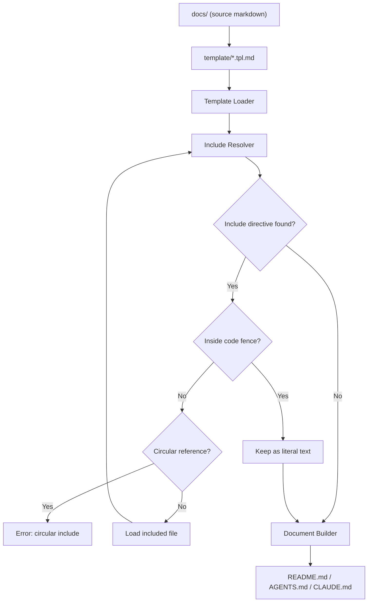
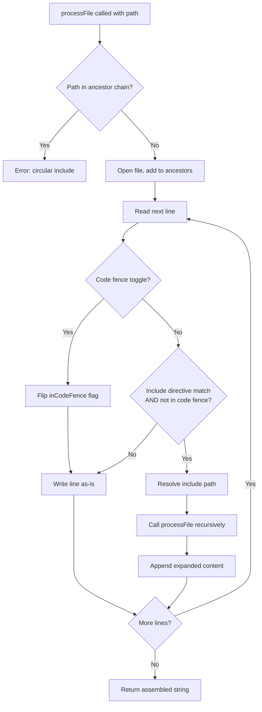

<!-- template/CLAUDE.tpl.md -->
<!--
⚠️ AUTO-GENERATED FILE — DO NOT EDIT
-->
# Project Context

## Overview

`docs-ssot` is a documentation Single Source of Truth (SSOT) generator.

It composes files such as README.md, CLAUDE.md, AGENTS.md, and other AI agent instruction files from small modular Markdown files.

---

## Background

AI-assisted development and AI agents are becoming a standard part of software development workflows.  
Different AI tools and agents require different instruction and context files, for example:

- README.md
- AGENTS.md
- CLAUDE.md
- Agent-specific rule files like `.claude/rules`, `.cursor/rules`
- Development guidelines
- Architecture documentation

As the number of AI tools increases (Claude, Codex, Cursor, etc.), maintaining these files becomes difficult.

Common problems include:

- Documentation duplication
- Inconsistent information across files
- Outdated documentation
- Manual copy & paste maintenance
- Documentation drift over time

Maintaining multiple documentation files without duplication becomes increasingly difficult.

---

## Problem

Documentation should follow the Single Source of Truth (SSOT) principle, but Markdown alone has limited reuse and composition capabilities.

Markdown is easy to write but lacks:

- File composition
- Reusable documentation modules
- Document templating
- Shared sections across multiple documents
- Structured documentation assembly

As a result, teams often duplicate content across multiple Markdown files.

---

## Solution

`docs-ssot` solves this problem by introducing:

- Modular Markdown documentation
- Template-based document structure
- Include directives for Markdown files
- Generated documentation files
- Single Source of Truth documentation architecture

Instead of writing large README files directly, documentation is split into small reusable Markdown modules and assembled into final documents using templates.

---

## Concept

The documentation workflow changes from this:

```
Manually write:

- README.md
- AGENTS.md
- CLAUDE.md
```

To this:

```
Write small docs in docs/
  ↓
Use templates
  ↓
docs-ssot build
  ↓
Generate README.md / AGENTS.md / CLAUDE.md
```

This ensures:

- No duplication
- Consistent documentation
- Easier updates
- Scalable documentation structure
- AI-friendly documentation organization

---

# Architecture

## Architecture Overview

The system consists of:

- Generator CLI
- Markdown modules
- Template files

## Documentation Pipeline Architecture

This document describes how the documentation generation pipeline works.

### Pipeline Overview

The `docs-ssot` system generates final documents (e.g., README.md, CLAUDE.md) from template files and modular Markdown sources.

The pipeline consists of the following stages:

1. Template Loading
2. Include Resolution
3. Recursive Expansion
4. Document Assembly
5. Output Generation

---

### Pipeline Flow



---

### Step 1 — Template Loading

The system loads template files from the `template/` directory.

Example:

```
template/README.tpl.md
template/AGENTS.tpl.md
template/CLAUDE.tpl.md
```

Templates define the structure of the final documents.

---

### Step 2 — Include Resolution

Templates and Markdown files may contain include directives:

The following style is compatible with [VitePress](https://vitepress.dev/).

```markdown
<!-- @include: docs/01_project/overview.md -->
```

The include resolver replaces this directive with the contents of the referenced file.

---

### Step 3 — Recursive Expansion

Included files may also contain include directives.

The system resolves includes recursively until all includes are expanded.

```
A.tpl.md
→ includes B.md
→ includes C.md
```

Final result:

```
A + B + C
```

### Step 4 — Link Path Rewriting

When each file is processed, relative Markdown links and image URLs are rewritten so they resolve correctly relative to the output file location rather than the source file location.

```markdown
[docsgen.yaml](../../docsgen.yaml)
```

---

### Step 5 — Document Assembly

After all includes are expanded, the document builder assembles the final Markdown document.

This includes:

- Merging expanded content
- Ensuring correct order

---

### Step 6 — Output Generation

The final document is written to where defined at [docsgen.yaml](./docsgen.yaml):

```
README.md
AGENTS.md
CLAUDE.md
```

These files are generated files and should not be edited directly.

---

### Include Resolution Detail

The include resolver processes directives recursively. The following diagram shows the exact resolution algorithm:



---

### Design Goals

The pipeline is designed with the following goals:

- Single Source of Truth (SSOT)
- Modular documentation
- Reusable Markdown components
- Template-based document generation
- Deterministic document builds
- Simple and predictable behavior

---

# Development Guide

### Setup

```sh
make build
make docs
```

# Testing

This document describes the testing strategy for docs-ssot.

## Overview

The project includes tests for the documentation generator, include resolver, and pipeline processing.

Testing ensures that documentation generation is deterministic, correct, and safe from issues such as missing includes or circular references.

---

## What We Test

The following components should be tested:

### Include Resolver

- Include directive parsing
- File loading
- Recursive includes
- Circular include detection
- Missing file errors

### Template Processing

- Template loading
- Include expansion inside templates
- Final document assembly

### Pipeline

- End-to-end document generation
- README generation
- AGENTS.md, CLAUDE.md generation
- Multiple template builds

---

## Test Types

### Unit Tests

Unit tests should cover:

- Include parsing
- Path resolution
- Circular include detection
- File loading logic
- Markdown merging

### Integration Tests

Integration tests should:

- Run the generator on a test docs directory
- Generate README.md
- Compare output with expected files

Example flow:

```
testdata/
docs/
template/
expected/
```

Test steps:

1. Run generator
2. Generate README.md
3. Compare with expected/README.md
4. Test should fail if output differs

---

## Example Test Cases

### Include Resolver

* Include single file
* Include nested files
* Include multiple files
* Missing file error
* Circular include error

### Generator

* Generate README from template
* Generate CLAUDE from template
* Multiple includes in template
* Nested includes
* Empty include file

---

## Deterministic Output

Generated documents must always be deterministic:

* Same input → same output
* No timestamps in generated files
* No random ordering
* Stable include order

This is important for Git diffs and CI.

---

## CI Testing

Tests should run in CI on every pull request.

Typical CI steps:

```sh
go test ./...
docs-ssot build
git diff --exit-code README.md
```

This ensures that generated files are always up to date.

---

## Recommended Test Command

```sh
make test
```

Example Makefile:

```makefile
test:
	go test ./...

test-e2e:
	docs-ssot build
	git diff --exit-code
```

---

# Glossary

# Glossary

This glossary defines important terms used in this project so that AI agents and contributors use consistent terminology.

## Documentation System Terms

### SSOT (Single Source of Truth)

A design principle where documentation content exists in only one place.
All generated documents (e.g., README.md, AGENTS.md, CLAUDE.md) are built from the docs/ directory, which is the single source of truth.

### Docs Directory

The `docs/` directory contains all documentation source files.
These files are modular Markdown documents and should be edited instead of generated files.

### Template

Template files define the structure of generated documents.
Templates usually live in the `template/` directory and include documentation files using include directives.

Example:

```
<!-- @include: docs/01_project/overview.md -->
```

### Include Directive

A special comment directive used to include another Markdown file into a template or document.

Format:

```
<!-- @include: path/to/file.md -->
```

The include resolver replaces this directive with the contents of the referenced file.

### Include Resolver

A component that processes include directives and expands them into actual content.
It also handles recursive includes and circular include detection.

### Generator

The generator is the main program that builds final documents from templates and docs sources.

Responsibilities:

- Load templates
- Resolve includes
- Assemble documents
- Write generated files

### Pipeline

The documentation generation process consisting of multiple stages:

1. Template Loading
2. Include Resolution
3. Recursive Expansion
4. Document Assembly
5. Output Generation

### Generated Files

Files produced by the generator, such as:

- README.md
- CLAUDE.md

These files should not be edited manually.

### Template Expansion

The process of resolving include directives inside templates and Markdown files to produce a final document.

### Recursive Include

When an included file itself contains include directives that must also be resolved.

Example:

```
A.md includes B.md
B.md includes C.md
```

Final document becomes:

```
A + B + C
```

### Circular Include

A circular reference between included files.

Example:

```
A.md includes B.md
B.md includes A.md
```

The system must detect and prevent circular includes.

---

## Project Structure Terms

### Modular Documentation

Documentation written as small reusable Markdown files instead of one large document.

### Documentation as Code

Treating documentation like source code:

- Version controlled
- Modular
- Reviewed
- Generated
- Tested

### Template-Based Documentation

Final documents are not written directly.
Instead, templates define structure and content is included from source files.

---

## AI Documentation Terms

### CLAUDE.md

A generated document intended to provide context and instructions for AI agents working in this repository.

### AI Context

Information provided to AI tools so they understand:

- Project structure
- Documentation rules
- Architecture
- Terminology
- Development workflow
