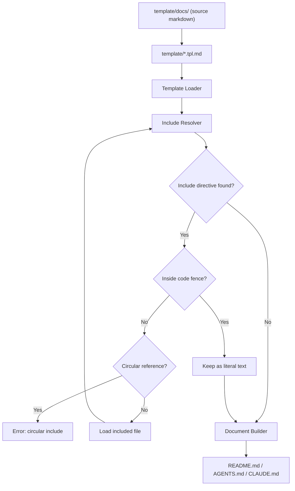
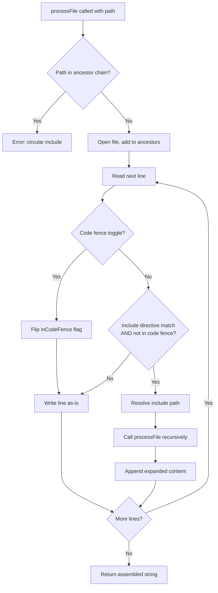

<!--
⚠️ AUTO-GENERATED FILE — DO NOT EDIT - template/AGENTS.tpl.md
-->
# Project Context

## Overview

`docs-ssot` is a documentation Single Source of Truth (SSOT) generator.

It composes files such as README.md, CLAUDE.md, AGENTS.md, and other AI agent instruction files from small modular Markdown files.

---

## Background

AI-assisted development and AI agents are becoming a standard part of software development workflows.  
Different AI tools and agents require different instruction and context files, for example:

- README.md
- AGENTS.md
- CLAUDE.md
- Agent-specific rule files like `.claude/rules`, `.cursor/rules`
- Development guidelines
- Architecture documentation

As the number of AI tools increases (Claude, Codex, Cursor, etc.), maintaining these files becomes difficult.

Common problems include:

- Documentation duplication
- Inconsistent information across files
- Outdated documentation
- Manual copy & paste maintenance
- Documentation drift over time

Maintaining multiple documentation files without duplication becomes increasingly difficult.

---

## Problem

Documentation should follow the Single Source of Truth (SSOT) principle, but Markdown alone has limited reuse and composition capabilities.

Markdown is easy to write but lacks:

- File composition
- Reusable documentation modules
- Document templating
- Shared sections across multiple documents
- Structured documentation assembly

As a result, teams often duplicate content across multiple Markdown files.

---

## Solution

`docs-ssot` solves this problem by introducing:

- Modular Markdown documentation
- Template-based document structure
- Include directives for Markdown files
- Generated documentation files
- Single Source of Truth documentation architecture

Instead of writing large README files directly, documentation is split into small reusable Markdown modules and assembled into final documents using templates.

---

## Concept

The documentation workflow changes from this:

```
Manually write:

- README.md
- AGENTS.md
- CLAUDE.md
```

To this:

```
Write small docs in docs/
  ↓
Use templates
  ↓
docs-ssot build
  ↓
Generate README.md / AGENTS.md / CLAUDE.md
```

This ensures:

- No duplication
- Consistent documentation
- Easier updates
- Scalable documentation structure
- AI-friendly documentation organization

---

## SSOT Rules for AI Agents

This repository uses `docs-ssot`, a documentation Single Source of Truth generator.

All documentation is written as small modular Markdown files under `template/docs/`.
Final documents (`README.md`, `CLAUDE.md`, `AGENTS.md`) are **generated build artifacts**.

### Critical Rules

- **Never edit** `README.md`, `CLAUDE.md`, or `AGENTS.md` directly — they are overwritten on every build
- **Edit source files** under `template/docs/` instead
- **Edit templates** under `template/*.tpl.md` to change document structure
- After editing, run `make docs` to regenerate output

### Build Pipeline

```
template/docs/**/*.md  →  template/*.tpl.md  →  docs-ssot build  →  README.md / CLAUDE.md / AGENTS.md
```

### Include Directive

Templates and source files use include directives to compose content:

```markdown
<!-- @include: docs/01_project/overview.md -->
<!-- @include: docs/02_product/ -->
<!-- @include: docs/**/*.md level=+1 -->
```

Includes are resolved recursively. Circular includes cause a build error.

---

# Repository Structure

## Directory Structure

```
docs-ssot/
├── cmd/docs-ssot/main.go       # CLI entry point
├── internal/
│   ├── cli/                    # Cobra subcommands (build, check, include, validate, version)
│   ├── config/config.go        # YAML config loader (docsgen.yaml)
│   ├── dupcheck/               # Near-duplicate section detector (TF-IDF cosine similarity)
│   ├── generator/generator.go  # Build orchestrator (Build, Validate)
│   └── processor/              # Include resolver + content transformers
│       ├── processor.go        # Core: ProcessFile, include resolution, glob/directory support
│       ├── heading.go          # HeadingTransformer: level=±N adjustment
│       ├── link.go             # LinkTransformer: relative path rewriting
│       └── transformer.go      # Transformer interface and Apply function
├── template/
│   ├── docs/                   # Source Markdown files (SSOT — edit here)
│   │   ├── 01_project/         # Project overview, vision, roadmap
│   │   ├── 02_product/         # Product concept and features
│   │   ├── 03_architecture/    # System architecture, pipeline, diagrams
│   │   ├── 04_development/     # Setup, testing, linting guides
│   │   ├── 05_ai/              # AI agent context and rules
│   │   └── 06_reference/       # Commands and directory reference
│   ├── README.tpl.md           # Template for README.md
│   ├── CLAUDE.tpl.md           # Template for CLAUDE.md
│   └── AGENTS.tpl.md           # Template for AGENTS.md
├── docsgen.yaml                # Build targets: template → output mapping
├── Makefile                    # Build, lint, test, docs commands
├── .golangci.yml               # Linting configuration (46+ linters)
├── .goreleaser.yaml            # Release automation
└── lefthook.yml                # Git hooks (pre-commit, pre-push)
```

### Generated Files (do not edit)

- `README.md` — generated from `template/README.tpl.md`
- `CLAUDE.md` — generated from `template/CLAUDE.tpl.md`
- `AGENTS.md` — generated from `template/AGENTS.tpl.md`

---

# Architecture

## Architecture Overview

The system consists of:

- Generator CLI
- Markdown modules
- Template files

## System Architecture

`docs-ssot` is composed of three main layers:

1. Generator CLI (docs-ssot)
2. Markdown source files (docs/)
3. Template files (template/)

The generator reads template files, resolves include directives, and produces final documents such as `README.md` and `AGENTS.md`, `CLAUDE.md`.

---

### `docs-ssot` CLI Core Components

Internally, the generator is intentionally simple and built around three core components:

#### 1. Template Loader

Responsible for loading template files.

- Reads template files from the template directory
- Provides template content to the include resolver

Templates define the structure of generated documents.

---

#### 2. Include Resolver

Responsible for resolving include directives.

- Parses include directives
- Loads referenced Markdown files
- Expands includes recursively
- Supports directory and glob includes
- Detects circular includes
- Returns fully expanded Markdown content

This is the core component of the system.

#### 3. Link Path Rewriter

Responsible for rewriting relative links and image URLs in processed files.

- Adjusts link paths to be correct relative to the output file location
- Handles both Markdown links and image references
- Ensures links work regardless of source file depth

---

#### 4. Document Builder

Responsible for generating final output files.

- Receives expanded Markdown content
- Assembles the final document
- Writes output files (e.g., README.md, AGENTS.md, CLAUDE.md)
- Ensures deterministic output

---

### Components

### docs/

The docs directory contains the Single Source of Truth Markdown files.
Each file represents a small, reusable piece of documentation.

These files should:

- be small
- be reusable
- contain only one topic
- not depend on document structure

---

### template/

Template files define document structure.

They do not contain actual documentation content, only structure and include directives.

Examples:

- README.tpl.md
- CLAUDE.tpl.md

Templates decide:

- document order
- document sections
- which content appears in which output

---

### Generator (docs-ssot)

The generator is a CLI tool that orchestrates the core components:

1. Load template (Template Loader)
2. Resolve includes (Include Resolver)
3. Write output (Document Builder)

### `docsgen.yaml` Config file

Configuration for input file and output file.

```yaml
targets:
  - input: template/README.tpl.md
    output: README.md

  - input: template/AGENTS.tpl.md
    output: AGENTS.md

  - input: template/CLAUDE.tpl.md
    output: CLAUDE.md
```

---

## Document Build Flow

The document generation flow works like this:



---

### Design Principles

The system is designed with the following principles:

- Single Source of Truth
- Modular documentation
- Template-based composition
- Generated outputs
- Documentation as code
- Deterministic builds
- Simple implementation
- No heavy static site generator

---

### Design Philosophy

`docs-ssot` is intentionally minimal.

Instead of implementing a full template engine, the system performs only four operations:

1. Load templates
2. Expand includes (with heading level adjustment)
3. Rewrite relative link paths
4. Write documents

Everything else is handled through Markdown structure and file organization.

---

# Include Specification

This document defines the include directive specification used by `docs-ssot`.

## Overview

The include directive allows Markdown files and templates to include other Markdown files.
Includes are expanded recursively to build final generated documents.

---

## Include Directive Syntax

```
<!-- @include: path [level=<delta>] -->
```

Example:

```
<!-- @include: docs/01_project/overview.md -->
```

The directive must be written inside an HTML comment.

An optional `level` parameter adjusts the heading depth of the included content:

```
<!-- @include: docs/03_architecture/overview.md level=+1 -->
<!-- @include: docs/03_architecture/overview.md level=-1 -->
<!-- @include: docs/03_architecture/overview.md level=+2 -->
```

| Parameter | Meaning |
|-----------|---------|
| `level=+1` | Deepen all headings by one level (`##` → `###`) |
| `level=+2` | Deepen all headings by two levels (`##` → `####`) |
| `level=-1` | Shallow all headings by one level (`###` → `##`) |
| `level=0` | No change (same as omitting the parameter) |

Heading levels are clamped to the valid range `[1, 6]`.
Headings inside fenced code blocks in the included file are not adjusted.

---

## Supported Include Paths

The include directive supports multiple path formats.

### 1. Single File Include

```
<!-- @include: docs/01_project/overview.md -->
```

Includes a single Markdown file.

### 2. Directory Include

```
<!-- @include: docs/02_product/ -->
```

Includes all `.md` files in the directory (non-recursive).
Files are included in sorted filename order.
The trailing `/` in the path is required to trigger directory mode.
Subdirectories are skipped; only `.md` files directly in the specified directory are included.

### 3. Glob Include

```
<!-- @include: docs/02_product/*.md -->
```

Includes all files matching the glob pattern.
Files are included in sorted (lexical) order.
Glob metacharacters (`*`, `?`, `[`) in the path trigger glob mode.
If the pattern matches no files, no content is inserted (no error).
Subdirectories matched by the pattern are skipped; only regular files are included.

---

### 4. Recursive Glob Include

```
<!-- @include: docs/**/*.md -->
```

Includes all files matching the recursive glob pattern.
`**` matches zero or more path segments, so `docs/**/*.md` matches both `docs/file.md` and `docs/sub/deep/file.md`.
Files are included in sorted (lexical) path order.
If the root directory does not exist or no files match, no content is inserted (no error).
Directories are skipped; only regular files are included.

---

## Include Order

When including multiple files (directory or glob), files are included in alphabetical order.

Recommended file naming:

```
01_overview.md
02_features.md
03_usecases.md
```

This ensures deterministic document structure.

---

## Recursive Includes

Included files may contain include directives themselves.

Example:

```
A.md includes B.md
B.md includes C.md
```

Final expanded document:

```
A + B + C
```

The system expands includes recursively until no include directives remain.

The algorithm used for recursive resolution:



---

## Circular Include Detection

Circular includes are detected and treated as errors.

Example:

```
A.md includes B.md
B.md includes C.md
C.md includes A.md
```

This must result in an error.

---

## Missing File Handling

If an included file does not exist, the generator must return an error and stop the build.

Includes must not fail silently.

---

## Path Rules

- Paths are resolved relative to the file containing the directive
- Only `.md` files can be included
- Include directives must be on their own line
- Includes are expanded before document generation

---

## Summary

Supported include formats:

| Format | Description |
|-------|-------------|
| file.md | Single file |
| dir/ | All markdown files in directory |
| *.md | Glob include |
| **/*.md | Recursive glob include |

Rules:

- Includes are expanded recursively
- Files are included in sorted order
- Circular includes are errors
- Missing files are errors
- Only Markdown files can be included

---

# Development Guide

## Setup

### Prerequisites

- Go 1.26+
- make

### Install

```sh
go install github.com/hiromaily/docs-ssot/cmd/docs-ssot@latest
```

Or build from source:

```sh
git clone https://github.com/hiromaily/docs-ssot.git
cd docs-ssot
make build
```

The binary is output to `bin/docs-ssot`.

### Quick Start

1. Create source Markdown files under `template/docs/`
2. Create template files under `template/` (e.g., `README.tpl.md`)
3. Define build targets in `docsgen.yaml`:

```yaml
targets:
  - input: template/README.tpl.md
    output: README.md
```

4. Generate documents:

```sh
docs-ssot build
```

### Development Setup

```sh
make install-dev   # Install lefthook and golangci-lint
make build         # Build the binary
make docs          # Generate documentation
make test          # Run tests
```

## Testing

This document describes the testing strategy for docs-ssot.

### Overview

The project includes tests for the documentation generator, include resolver, and pipeline processing.

Testing ensures that documentation generation is deterministic, correct, and safe from issues such as missing includes or circular references.

---

### What We Test

The following components should be tested:

### Include Resolver

- Include directive parsing
- File loading
- Recursive includes
- Circular include detection
- Missing file errors

### Template Processing

- Template loading
- Include expansion inside templates
- Final document assembly

### Pipeline

- End-to-end document generation
- README generation
- AGENTS.md, CLAUDE.md generation
- Multiple template builds

---

### Test Types

### Unit Tests

Unit tests should cover:

- Include parsing
- Path resolution
- Circular include detection
- File loading logic
- Markdown merging

### Integration Tests

Integration tests should:

- Run the generator on a test docs directory
- Generate README.md
- Compare output with expected files

Example flow:

```
testdata/
docs/
template/
expected/
```

Test steps:

1. Run generator
2. Generate README.md
3. Compare with expected/README.md
4. Test should fail if output differs

---

### Example Test Cases

### Include Resolver

* Include single file
* Include nested files
* Include multiple files
* Missing file error
* Circular include error

### Generator

* Generate README from template
* Generate CLAUDE from template
* Multiple includes in template
* Nested includes
* Empty include file

---

### Deterministic Output

Generated documents must always be deterministic:

* Same input → same output
* No timestamps in generated files
* No random ordering
* Stable include order

This is important for Git diffs and CI.

---

### CI Testing

Tests should run in CI on every pull request.

Typical CI steps:

```sh
go test ./...
docs-ssot build
git diff --exit-code README.md
```

This ensures that generated files are always up to date.

---

### Recommended Test Command

```sh
make test
```

Example Makefile:

```makefile
test:
	go test ./...

test-e2e:
	docs-ssot build
	git diff --exit-code
```

## Linting

This project uses `golangci-lint` (v2) with 46+ linters enabled.

The linter is pinned as a Go tool dependency and invoked via `go tool golangci-lint`.

### Commands

| Command | Description |
|---------|-------------|
| `make go-lint` | Lint and auto-fix |
| `make go-lint-check` | Lint check only (no fix) |
| `make go-lint-fast` | Fast linters only with auto-fix |
| `make go-fmt` | Format all Go files with gofumpt |

### Key Rules

- **Max line length**: 200 characters
- **Max cyclomatic complexity**: 16
- **Formatting**: gofumpt (stricter than gofmt)

### Git Hooks (lefthook)

| Hook | Command | Trigger |
|------|---------|---------|
| `pre-commit` | `make go-fmt` | `*.go` files staged |
| `pre-push` | `make go-lint` | `*.go` files pushed |

Run `make install-dev` to set up hooks.

---

# Commands Reference

This document describes the available CLI commands for docs-ssot.

## Overview

The CLI provides commands for generating documents from templates and managing documentation sources.

| Command | Description |
|---------|-------------|
| `docs-ssot build` | Generate final documents from templates |
| `docs-ssot check` | Check docs for SSOT violations by detecting near-duplicate sections |
| `docs-ssot include <file>` | Resolve includes and print expanded result to stdout |
| `docs-ssot migrate [files...]` | Decompose existing Markdown files into SSOT section structure |
| `docs-ssot migrate --from <tool>` | Migrate AI tool configs from one tool to others |
| `docs-ssot validate` | Validate documentation structure without generating output |
| `docs-ssot version` | Print the build version |

---

## docs build

Generate final documents (e.g., README.md, CLAUDE.md) from templates.

```
docs-ssot build
```

### What it does

- Reads template files
- Resolves `@include` directives
- Expands included Markdown files
- Writes final generated documents

---

## docs check

Check docs for SSOT violations by detecting near-duplicate sections across Markdown files.

```
docs-ssot check [flags]
```

Uses TF-IDF cosine similarity to compare sections at the specified heading level. Sections scoring above the threshold are reported as potential SSOT violations — places where the same information exists in multiple source files.

### Flags

| Flag | Default | Description |
|------|---------|-------------|
| `--root` | `docs` | Root directory to scan for Markdown files |
| `--threshold` | `0.82` | Similarity cutoff (0.0–1.0); pairs above this score are reported |
| `--min-chars` | `120` | Minimum character count for a section to be included in comparison |
| `--section-level` | `2` | Heading level used as section boundary (1–6) |
| `--format` | `text` | Output format: `text` or `json` |
| `--exclude` | — | Exclude path pattern (repeatable) |

### Examples

Basic check with default settings:

```
docs-ssot check
```

Lower threshold to catch more candidates:

```
docs-ssot check --threshold 0.75
```

Compare at H3 level, exclude changelogs, output JSON:

```
docs-ssot check --section-level 3 --exclude docs/changelog/** --format json
```

### Output

Text output (one block per similar pair):

```
score=0.891
A: docs/auth/overview.md [API > Authentication]
B: docs/setup/login.md [Setup > Authentication]
A title: Authentication
B title: Authentication
A snippet: Authentication tokens must be refreshed before they expire...
B snippet: Access tokens must be renewed prior to expiry...
----------------------------------------------------------------------------------------------------
```

A score of `1.0` means identical content; `0.82` (default threshold) catches near-duplicates while filtering loosely related content.

### Exit behaviour

Exits `0` whether or not duplicates are found. Use `--format json` and inspect `result_count` in CI pipelines.

---

## docs migrate

Decompose existing monolithic Markdown files (e.g., README.md, CLAUDE.md) into the docs-ssot section structure.

```
docs-ssot migrate [files...] [flags]
```

This is the primary adoption command. It takes existing documentation files and converts them into modular, reusable sections with template files that reproduce the original document structure via `@include` directives.

### What it does

1. **Splits** each input file by H2 headings into candidate sections
2. **Categorises** sections into directories (`project/`, `development/`, `architecture/`, `reference/`, `product/`, `misc/`) based on heading keyword heuristics
3. **Detects duplicates** across input files using TF-IDF cosine similarity (reuses the `check` command's engine)
4. **Creates section files** under `template/sections/<category>/<slug>.md`
5. **Creates template files** under `template/pages/<name>.tpl.md` with `@include` directives
6. **Creates `docsgen.yaml`** if it does not already exist
7. **Verifies round-trip** by running `build` and comparing output against originals

### Section categorisation

Sections are assigned to categories based on heading keywords:

| Heading keywords | Category |
|-----------------|----------|
| Architecture, Design, System, Pipeline | `architecture/` |
| Overview, About, Introduction, Background | `project/` |
| Install, Setup, Getting Started, Prerequisites | `development/` |
| Test, Testing, CI | `development/` |
| Lint, Format, Code Quality | `development/` |
| Contributing, Contribute | `development/` |
| API, Commands, CLI, Reference | `reference/` |
| License, Changelog, Roadmap | `project/` |
| FAQ, Troubleshooting | `product/` |
| (fallback) | `misc/` |

### Duplicate handling

When the same content appears in multiple input files:

1. TF-IDF cosine similarity is computed between all cross-file section pairs
2. Pairs scoring above the threshold are merged into a single section file
3. Both templates reference the shared section via `@include`

### Flags

| Flag | Default | Description |
|------|---------|-------------|
| `--output-dir` | `template/sections` | Where to write section files |
| `--template-dir` | `template/pages` | Where to write template files |
| `--section-level` | `2` | Heading level used as section boundary (1–6) |
| `--threshold` | `0.82` | Similarity threshold for duplicate detection (0.0–1.0) |
| `--dry-run` | `false` | Print the migration plan without writing files |

### Examples

Migrate existing README and CLAUDE.md:

```
docs-ssot migrate README.md CLAUDE.md
```

Preview migration plan without writing files:

```
docs-ssot migrate --dry-run README.md CLAUDE.md
```

Lower the duplicate detection threshold:

```
docs-ssot migrate --threshold 0.75 README.md
```

Split at H1 boundaries instead of H2:

```
docs-ssot migrate --section-level 1 README.md
```

### Output

```
Parsed README.md: 8 sections
Parsed CLAUDE.md: 6 sections
Detected 3 duplicate sections (similarity > 0.82):
  "Architecture Overview" — merged into template/sections/architecture/overview.md (score=0.950)
  "Setup" — merged into template/sections/development/setup.md (score=1.000)
  "Testing" — merged into template/sections/development/testing.md (score=0.891)
Creating 11 unique section files in template/sections
  template/sections/project/overview.md
  template/sections/development/setup.md
  ...
Created template/pages/README.tpl.md (8 includes)
Created template/pages/CLAUDE.tpl.md (6 includes)
Created docsgen.yaml
Verifying round-trip...
Round-trip verification: OK
Migration complete.
```

### Post-migration workflow

After `migrate`, the user's workflow becomes:

```sh
# Edit source sections
vim template/sections/development/setup.md

# Regenerate all outputs
docs-ssot build

# Verify
git diff README.md CLAUDE.md
```

---

### Agent-aware migration (`--from`)

With `--from`, `migrate` scans AI tool configuration files (rules, skills, commands, subagents) from the specified tool and generates SSOT sections with per-tool templates for the target tools.

```
docs-ssot migrate --from <tool> [--to <tools>] [flags]
```

#### What it does

1. **Scans** the source tool's configuration directory for rules, skills, commands, and subagents
2. **Strips** frontmatter from source files and shifts H1→H2 headings
3. **Creates section files** under `template/sections/ai/<type>/<slug>.md`
4. **Generates templates** for each target tool with appropriate frontmatter
5. **Updates `docsgen.yaml`** with new build targets
6. **Verifies round-trip** by building and comparing against originals

#### Flags

| Flag | Default | Description |
|------|---------|-------------|
| `--from` | (required) | Source AI tool to migrate from (`claude`, `cursor`, `copilot`) |
| `--to` | all except `--from` | Target tools, comma-separated (`cursor,copilot,codex`) |
| `--convert-commands` | `false` | Convert legacy commands to skills during migration |
| `--infer-globs` | `false` | Infer path-gated globs from rule slug names |
| `--dry-run` | `false` | Print the migration plan without writing files |

#### Examples

Migrate Claude configs to all other tools:

```
docs-ssot migrate --from claude
```

Migrate to specific tools only:

```
docs-ssot migrate --from claude --to cursor,codex
```

Preview migration plan:

```
docs-ssot migrate --from claude --dry-run
```

Migrate with path inference and command conversion:

```
docs-ssot migrate --from claude --to cursor --infer-globs --convert-commands
```

Combine agent and file migration:

```
docs-ssot migrate --from claude --to cursor README.md CLAUDE.md
```

#### Output

```
Detected source tool: claude (5 files)
Target tools: cursor, copilot, codex

Creating sections:
  template/sections/ai/rules/architecture.md
  template/sections/ai/rules/testing.md
  template/sections/ai/skills/deploy.md
  template/sections/ai/subagents/critic.md
  template/sections/ai/subagents/debugger.md

Creating templates (3 tools × 5 files):
  cursor: 5 templates
  copilot: 5 templates
  codex: 4 templates

Updated docsgen.yaml (14 new targets)
Verifying round-trip...
Round-trip verification: OK
Agent migration complete.
```

---

## docs include

Resolve include directives and print the expanded result to stdout.

```
docs-ssot include <file>
```

Example:

```
docs-ssot include template/README.tpl.md
```

Useful for debugging template expansion without writing any output files.

---

## docs validate

Validate documentation structure without generating any output files.

```
docs-ssot validate
```

Performs a dry run over all templates in `docsgen.yaml`.

### Validation checks

- Missing include files
- Circular includes
- Invalid paths

### Output

Success:

```
OK
```

Failure (one line per failing template):

```
ERROR: include error (/path/to/file.md): open /path/to/file.md: no such file or directory
```

Exits with a non-zero status code when any error is found.

---

## docs version

Print the build version.

```
docs-ssot version
```

---

## Typical Workflow

```
docs-ssot validate
docs-ssot build
```

Or during development:

```
docs-ssot include template/README.tpl.md
```

---

## Recommended Makefile Shortcuts

```
make docs                                     # generate all output targets
make docs-validate                            # validate all templates
make docs-include FILE=template/README.tpl.md # expand and print a template
make docs-check                               # check docs for SSOT violations (default settings)
make docs-check ARGS="--threshold 0.75"       # check with custom flags
make docs-migrate FILES="README.md CLAUDE.md" # migrate existing docs to SSOT structure
make docs-migrate FILES="README.md" ARGS="--dry-run"  # preview migration plan
make docs-migrate-from FROM=claude             # migrate Claude configs to all other tools
make docs-migrate-from FROM=claude TO=cursor   # migrate Claude to Cursor only
make docs-version                             # print the build version
```

---

# AI Agent Configuration

## AI Agent Configuration Landscape (April 2026)

AI coding agents (Claude Code, Codex, Cursor, GitHub Copilot) each require configuration files to understand project context. These files fall into four layers:

### Layer 1 — Persistent Instructions

Files the agent reads every session to understand project rules and architecture.

| Tool | Primary file | Scoped files |
|------|-------------|-------------|
| Claude Code | `CLAUDE.md` | Subdirectory `CLAUDE.md`, `.claude/CLAUDE.md`, `CLAUDE.local.md` |
| Codex | `AGENTS.md` | Nested `AGENTS.md` per directory, `AGENTS.override.md` |
| Cursor | `.cursor/rules/*.mdc` | Per-file via `globs` frontmatter |
| Copilot | `.github/copilot-instructions.md` | `.github/instructions/*.instructions.md`, `AGENTS.md` |

### Layer 2 — Scoped Rules

Topic-specific or path-gated rules that supplement the primary instruction file.

| Tool | Location | Format |
|------|----------|--------|
| Claude Code | `.claude/rules/*.md` | Markdown, optionally path-gated |
| Codex | Nested `AGENTS.md` hierarchy | Markdown, directory-scoped |
| Cursor | `.cursor/rules/*.mdc` | MDC (Markdown + YAML frontmatter) |
| Copilot | `.github/instructions/*.instructions.md` | Markdown + `applyTo` frontmatter |

### Layer 3 — Reusable Workflows (Skills / Commands)

Packaged multi-step procedures the agent invokes on demand or automatically.

| Tool | Skills location | Command location | Trend |
|------|----------------|-----------------|-------|
| Claude Code | `.claude/skills/<name>/SKILL.md` | `.claude/commands/*.md` (legacy) | Commands integrated into skills |
| Codex | `.agents/skills/<name>/SKILL.md` | `~/.codex/prompts/*.md` (deprecated) | Custom prompts deprecated, skills preferred |
| Cursor | `.cursor/skills/<name>/SKILL.md` | Slash commands | Commands migrating to skills |
| Copilot | `.github/skills/<name>/SKILL.md` | `.github/prompts/*.prompt.md` | Prompt files for explicit invocation |

### Layer 4 — Agent Execution Settings

Runtime configuration controlling model selection, permissions, subagents, and external connections.

| Tool | Settings file | Subagents | Hooks |
|------|--------------|-----------|-------|
| Claude Code | `.claude/settings.json` | `.claude/agents/*.md` | Hooks in `settings.json` |
| Codex | `.codex/config.toml` | `.codex/agents/*.toml` | `.codex/hooks.json` |
| Cursor | `.cursor/cli.json` | `.cursor/agents/*.md` | — |
| Copilot | VS Code / GitHub settings | `.github/agents/*.agent.md` | — |

---

### Key Trends

1. **`AGENTS.md` is the de facto cross-tool standard** — supported by Claude, Codex, Cursor, and Copilot
2. **Claude Code has the richest configuration** — skills, agents, commands, memory, hooks, settings
3. **Cursor is evolving from IDE to Agent-first** — rules and commands are migrating to skills
4. **Copilot is GitHub-native** — deeply integrated with issues, PRs, and the `.github/` directory
5. **Skills are converging** — all four tools support `SKILL.md`-based skills with YAML frontmatter
6. **Commands are being deprecated or merged into skills** across all platforms

## Claude Code

Claude Code has the most comprehensive configuration system among AI coding agents.

### File Overview

| Category | File | Scope |
|----------|------|-------|
| Instructions | `CLAUDE.md` | Project-wide context and rules |
| Instructions | `CLAUDE.local.md` | Personal overrides (gitignored) |
| Instructions | `.claude/CLAUDE.md` | Alternative project instructions |
| Rules | `.claude/rules/*.md` | Topic-scoped or path-gated rules |
| Rules | `~/.claude/rules/*.md` | User-level global rules |
| Skills | `.claude/skills/<name>/SKILL.md` | Reusable workflows |
| Skills | `~/.claude/skills/<name>/SKILL.md` | User-level global skills |
| Commands | `.claude/commands/*.md` | Legacy custom commands (integrated into skills) |
| Subagents | `.claude/agents/*.md` | Project-scoped custom subagents |
| Subagents | `~/.claude/agents/*.md` | User-level custom subagents |
| Settings | `.claude/settings.json` | Permissions, hooks, MCP servers |
| Settings | `.claude/settings.local.json` | Personal settings overrides |
| Settings | `~/.claude/settings.json` | User-level global settings |

### Instruction Hierarchy

Claude Code merges instructions from multiple scopes (global > project > subdirectory):

1. `~/.claude/CLAUDE.md` (user-level)
2. `CLAUDE.md` (project root)
3. Subdirectory `CLAUDE.md` files (deeper = more specific)

### Rules

`.claude/rules/*.md` files provide topic-specific or path-gated instructions. They supplement `CLAUDE.md` without duplicating its content.

Rules have no required frontmatter. They are plain Markdown files that Claude reads automatically.

### Skills

Skills are the primary mechanism for reusable workflows. Custom commands (`.claude/commands/*.md`) are integrated into skills — both create slash commands, but skills offer richer configuration.

#### Skill Frontmatter

```yaml
---
name: deploy                        # Optional. Creates /deploy slash command
description: Deploy to production   # Recommended. Used for auto-invocation matching
argument-hint: [env]                # Optional. Shown in completion UI
disable-model-invocation: true      # Optional. Prevents auto-invocation (manual /name only)
user-invocable: true                # Optional. Whether it appears in slash command menu
allowed-tools:                      # Optional. Restricts available tools during skill execution
  - Read
  - Edit
  - Bash(make *)
model: opus                         # Optional. Override model for this skill
effort: high                        # Optional. Reasoning effort level
context: fork                       # Optional. Run in forked subagent context
---
```

Claude has the most feature-rich skill frontmatter of all tools.

### Subagents

Custom subagents are defined as Markdown files in `.claude/agents/`. Each file defines a specialized agent with its own system prompt, available tools, and model configuration.

### Settings

`.claude/settings.json` controls:

- Permissions and approval policies
- Hook definitions (pre/post tool execution)
- MCP server connections
- Environment variables
- Model defaults

## OpenAI Codex

Codex uses `AGENTS.md` as its primary instruction mechanism, with a hierarchical directory-based scoping model.

### File Overview

| Category | File | Scope |
|----------|------|-------|
| Instructions | `AGENTS.md` | Project-wide and per-directory guidance |
| Instructions | `AGENTS.override.md` | Override file (takes precedence over `AGENTS.md`) |
| Instructions | `~/.codex/AGENTS.md` | User-level global instructions |
| Skills | `.agents/skills/<name>/SKILL.md` | Repository-scoped skills |
| Skills | `~/.agents/skills/<name>/SKILL.md` | User-level skills |
| Skills | `/etc/codex/skills/<name>/SKILL.md` | Admin-level skills |
| Subagents | `.codex/agents/*.toml` | Project-scoped subagents |
| Subagents | `~/.codex/agents/*.toml` | User-level subagents |
| Settings | `.codex/config.toml` | Project-scoped runtime config |
| Settings | `~/.codex/config.toml` | User-level runtime config |
| Hooks | `.codex/hooks.json` | Project-scoped hooks (experimental) |
| Hooks | `~/.codex/hooks.json` | User-level hooks |
| Commands | `~/.codex/prompts/*.md` | Custom prompts (deprecated, use skills) |

### Instruction Hierarchy

Codex builds an instruction chain by walking from the repository root to the current working directory. At each level, it looks for (in priority order):

1. `AGENTS.override.md`
2. `AGENTS.md`
3. Fallback filenames (configurable in `config.toml`)

Instructions accumulate — deeper directories add specificity to root-level rules. This makes `AGENTS.md` placement a structural design decision.

### Skills

Codex skills use the `.agents/skills/` directory (not `.codex/skills/`). Each skill requires a `SKILL.md` with YAML frontmatter.

#### Skill Frontmatter

```yaml
---
name: add-endpoint          # Required. Skill identifier
description: Add a new ...  # Required. Used for progressive disclosure matching
---
```

Codex has the most minimal skill frontmatter. The `description` is critical because Codex reads metadata first and loads full content only when needed (progressive disclosure).

Additional configuration can go in `agents/openai.yaml` within the skill directory.

### Settings (`config.toml`)

`config.toml` separates runtime concerns from project guidance:

| Setting | Purpose |
|---------|---------|
| `model` | Default model selection |
| `approval_policy` | `untrusted` / `on-request` / `never` |
| `sandbox_mode` | File access scope |
| `project_root_markers` | How Codex finds project boundaries |
| `project_doc_fallback_filenames` | Additional instruction file names |
| `[mcp_servers.*]` | External tool connections |
| `[agents.*]` | Subagent definitions |
| `[tools]` | Tool enablement (e.g., `web_search`) |

**Key distinction**: `AGENTS.md` = how to think about the code; `config.toml` = how to run the agent.

### Subagents

Codex subagents are defined as TOML files in `.codex/agents/`. They specify role, model, thread limits, and other execution parameters.

## Cursor

Cursor is transitioning from an IDE-centric model to an agent-first architecture. Rules are the primary configuration mechanism, with skills and subagents as newer additions.

### File Overview

| Category | File | Scope |
|----------|------|-------|
| Rules | `.cursor/rules/*.md` | Project rules (plain Markdown) |
| Rules | `.cursor/rules/*.mdc` | Project rules (MDC: Markdown + frontmatter) |
| Rules | `.cursorrules` | Legacy single-file rules (deprecated) |
| Skills | `.cursor/skills/<name>/SKILL.md` | Project-scoped skills |
| Subagents | `.cursor/agents/*.md` | Project-scoped subagents |
| Subagents | `.claude/agents/*.md` | Claude compatibility (also read by Cursor) |
| Subagents | `.codex/agents/*.toml` | Codex compatibility (also read by Cursor) |
| Settings | `~/.cursor/cli-config.json` | CLI permissions (user-level) |
| Settings | `.cursor/cli.json` | CLI permissions (project-level) |
| Ignore | `.cursorignore` | Files excluded from context |
| Compat | `AGENTS.md` | Cross-tool instructions (read by Cursor) |

### Rules

Rules are the core configuration for Cursor. Two formats are supported:

- **`.md`** — plain Markdown, always applied
- **`.mdc`** — MDC format with YAML frontmatter for conditional application

#### Rule Frontmatter (MDC format)

```yaml
---
description: Go layered architecture rules   # What the rule covers
globs:                                        # File patterns that activate this rule
  - "internal/**/*.go"
  - "pkg/**/*.go"
alwaysApply: true                             # Apply regardless of file context
---
```

Key fields:

- `description` — tells Cursor when the rule is relevant
- `globs` — file patterns that trigger the rule
- `alwaysApply` — force the rule to always be active

### Skills

Cursor supports Agent Skills (the emerging open standard). Skills can function as:

- **Implicit skills** — automatically invoked when the description matches the task
- **Explicit commands** — invoked only via `/skill-name` when `disable-model-invocation: true` is set

#### Skill Frontmatter

```yaml
---
name: add-endpoint                    # Skill identifier and slash command name
description: Add a new Go endpoint    # Used for auto-invocation matching
disable-model-invocation: true        # Optional. Makes it a manual-only command
---
```

Cursor can migrate existing rules and slash commands into skills. Migrated commands get `disable-model-invocation: true` to preserve explicit-invocation behavior.

### Subagents

Cursor reads subagent definitions from multiple locations for cross-tool compatibility:

1. `.cursor/agents/` (native)
2. `.claude/agents/` (Claude compatibility)
3. `.codex/agents/` (Codex compatibility)

### Migration Path

The trend in Cursor is:

- `.cursorrules` (single file) → `.cursor/rules/` (multiple files)
- Slash commands → Skills with `disable-model-invocation: true`
- Rules with reusable workflows → Skills

## GitHub Copilot

Copilot integrates natively with GitHub's directory conventions. It supports multiple instruction mechanisms, including the cross-tool `AGENTS.md` standard.

### File Overview

| Category | File | Scope |
|----------|------|-------|
| Instructions | `.github/copilot-instructions.md` | Repository-wide instructions |
| Instructions | `.github/instructions/*.instructions.md` | Path-specific instructions |
| Instructions | `AGENTS.md` | Cross-tool instructions (supported by coding agent) |
| Prompts | `.github/prompts/*.prompt.md` | Reusable prompt templates (public preview) |
| Skills | `.github/skills/<name>/SKILL.md` | Repository-scoped agent skills |
| Agents | `.github/agents/*.agent.md` | Custom agent definitions |
| CLI | `~/.copilot/copilot-instructions.md` | Local CLI instructions |

### Repository-Wide Instructions

`.github/copilot-instructions.md` is the primary instruction file. It applies to all Copilot interactions in the repository.

### Path-Specific Instructions

`.github/instructions/*.instructions.md` files provide scoped rules using YAML frontmatter:

#### Instruction Frontmatter

```yaml
---
applyTo: "internal/**/*.go"         # Required. File pattern this instruction applies to
excludeAgent: "code-review"          # Optional. Exclude specific agents
---
```

Key fields:

- `applyTo` — determines which files trigger this instruction
- `excludeAgent` — prevents specific agents (e.g., `code-review`, `coding-agent`) from seeing this instruction

### AGENTS.md Support

The Copilot coding agent reads `AGENTS.md` files, including nested ones in subdirectories. This provides cross-tool compatibility with Codex and other tools that use the `AGENTS.md` convention.

### Prompt Files

`.github/prompts/*.prompt.md` are reusable prompt templates. They serve as the closest equivalent to slash commands in Copilot — explicit-invocation templates for common tasks.

Prompt files are primarily Markdown body content with minimal frontmatter.

### Skills

Copilot supports agent skills via `SKILL.md` files. It also reads skill directories from other tool locations for compatibility.

#### Skill Frontmatter

```yaml
---
name: image-convert                              # Required. Skill identifier
description: Converts SVG images to PNG format   # Required. Trigger description
license: MIT                                     # Optional. License declaration
allowed-tools: Bash(convert-svg-to-png.sh)       # Optional. Permitted tools
---
```

#### Skill Discovery Paths

Copilot looks for skills in multiple locations:

1. `.github/skills/<name>/SKILL.md`
2. `.claude/skills/<name>/SKILL.md`
3. `.agents/skills/<name>/SKILL.md`

### CLI-Specific Configuration

For Copilot CLI usage:

- `~/.copilot/copilot-instructions.md` — local instructions
- `COPILOT_CUSTOM_INSTRUCTIONS_DIRS` — environment variable pointing to additional instruction directories

## Cross-Tool Mapping

### Concept Mapping

| Concept | Claude Code | Cursor | Codex | Copilot |
|---------|-------------|--------|-------|---------|
| Common instructions | `AGENTS.md` | `AGENTS.md` | `AGENTS.md` | `AGENTS.md` |
| Primary instructions | `CLAUDE.md` | `.cursor/rules/` | `AGENTS.md` | `.github/copilot-instructions.md` |
| Scoped rules | `.claude/rules/*.md` | `.cursor/rules/*.mdc` | Nested `AGENTS.md` | `.github/instructions/*.instructions.md` |
| Skills | `.claude/skills/` | `.cursor/skills/` | `.agents/skills/` | `.github/skills/` |
| Commands | `.claude/commands/` (legacy) | Slash commands (migrating) | `~/.codex/prompts/` (deprecated) | `.github/prompts/*.prompt.md` |
| Subagents | `.claude/agents/*.md` | `.cursor/agents/*.md` | `.codex/agents/*.toml` | `.github/agents/*.agent.md` |
| Settings | `.claude/settings.json` | Cursor settings / `.cursor/cli.json` | `.codex/config.toml` | VS Code / GitHub settings |

### Skill Frontmatter Comparison

All four tools use `SKILL.md` with YAML frontmatter, but the supported fields differ:

| Field | Claude | Cursor | Codex | Copilot |
|-------|--------|--------|-------|---------|
| `name` | Optional | Yes | **Required** | **Required** |
| `description` | Recommended | Yes | **Required** | **Required** |
| `argument-hint` | Yes | — | — | — |
| `disable-model-invocation` | Yes | Yes | — | — |
| `user-invocable` | Yes | — | — | — |
| `allowed-tools` | Yes | — | — | Yes |
| `model` | Yes | — | — | — |
| `effort` | Yes | — | — | — |
| `context` | Yes | — | — | — |
| `license` | — | — | — | Yes |

**Claude** has the richest frontmatter. **Codex** has the most minimal (name + description only).

### Rules Frontmatter Comparison

| Field | Cursor `.mdc` | Copilot `.instructions.md` | Claude `.claude/rules/*.md` | Codex |
|-------|---------------|---------------------------|----------------------------|-------|
| `description` | Yes | — | — (no frontmatter) | — (uses `AGENTS.md`) |
| `globs` | Yes | — | — | — |
| `alwaysApply` | Yes | — | — | — |
| `applyTo` | — | Yes | — | — |
| `excludeAgent` | — | Yes | — | — |

### Functional Categories

Understanding what goes where:

| What you want | Mechanism | Tools that support it |
|--------------|-----------|----------------------|
| Always-active project rules | Instructions file | All four |
| Path-specific rules | Scoped rules | Cursor (`globs`), Copilot (`applyTo`), Codex (nested `AGENTS.md`) |
| Reusable multi-step workflows | Skills | All four |
| Manual-only slash commands | Skills + `disable-model-invocation: true` | Claude, Cursor |
| Runtime config (model, permissions) | Settings file | Claude (`settings.json`), Codex (`config.toml`) |
| Specialized agent roles | Subagent definitions | All four |

## Best Practices for Multi-Tool Repositories

When a repository is used with multiple AI tools, follow these principles to minimize duplication and keep instructions consistent.

### Principle 1 — Single source of truth in `AGENTS.md`

Write shared project knowledge (architecture, coding rules, build commands, testing strategy) in `AGENTS.md` only. All four major tools read it.

### Principle 2 — Tool-specific files contain only deltas

`CLAUDE.md`, `.cursor/rules/`, `.github/copilot-instructions.md`, and `.codex/config.toml` should reference `AGENTS.md` and add only tool-specific behavior:

- Claude: subagent usage, skill invocation patterns
- Cursor: rule application granularity (`globs`)
- Codex: approval policy, sandbox mode, MCP connections
- Copilot: agent exclusions, prompt file conventions

### Principle 3 — Long procedures go into skills

Multi-step workflows (adding endpoints, running migrations, release checklists) belong in skills, not in instruction files. Skills are supported by all four tools.

### Principle 4 — Rules are constraints, not procedures

Rules should express what to do and what not to do. Procedures (how to do it step by step) belong in skills.

---

### Recommended Minimal Directory Structure

```
repo/
├── AGENTS.md                           # Cross-tool shared instructions
├── CLAUDE.md                           # Claude-specific delta
├── .claude/
│   ├── settings.json                   # Permissions, hooks, MCP
│   └── rules/
│       ├── architecture.md             # Topic-scoped rules
│       └── testing.md
├── .cursor/
│   └── rules/
│       ├── 00-core.mdc                 # Always-apply core rules
│       └── 10-go-architecture.mdc      # Path-gated Go rules
├── .codex/
│   └── config.toml                     # Runtime settings
├── .agents/
│   └── skills/
│       └── add-endpoint/
│          └── SKILL.md                 # Shared skill (Codex reads .agents/)
├── .github/
│   └── copilot-instructions.md         # Copilot-specific delta
└── README.md
```

### Recommended Full Directory Structure

```
repo/
├── AGENTS.md                           # Cross-tool shared instructions
├── CLAUDE.md                           # Claude delta
├── .claude/
│   ├── settings.json
│   ├── rules/
│   │   ├── architecture.md
│   │   ├── testing.md
│   │   └── db.md
│   ├── skills/
│   │   ├── add-endpoint/SKILL.md
│   │   ├── db-migration/SKILL.md
│   │   └── run-tests/SKILL.md
│   └── agents/
│       ├── reviewer.md
│       └── refactorer.md
├── .cursor/
│   ├── rules/
│   │   ├── 00-core.mdc
│   │   ├── 10-go-architecture.mdc
│   │   ├── 20-testing.mdc
│   │   └── 30-db.mdc
│   ├── skills/
│   │   ├── add-endpoint/SKILL.md
│   │   └── db-migration/SKILL.md
│   └── agents/
│       ├── reviewer.md
│       └── refactorer.md
├── .codex/
│   ├── config.toml
│   └── agents/
│       ├── reviewer.toml
│       └── refactorer.toml
├── .agents/
│   └── skills/
│       ├── add-endpoint/SKILL.md
│       ├── db-migration/SKILL.md
│       └── run-tests/SKILL.md
├── .github/
│   ├── copilot-instructions.md
│   ├── instructions/
│   │   ├── go.instructions.md
│   │   ├── testing.instructions.md
│   │   └── db.instructions.md
│   └── agents/
│       └── reviewer.agent.md
└── README.md
```

### What Goes Where — Decision Guide

| Question | Answer |
|----------|--------|
| Is it shared project knowledge? | `AGENTS.md` |
| Is it a runtime/execution setting? | Tool-specific config (`settings.json`, `config.toml`) |
| Is it a persistent constraint? | Rules (`.claude/rules/`, `.cursor/rules/`, `.github/instructions/`) |
| Is it a reusable multi-step procedure? | Skills (`.claude/skills/`, `.agents/skills/`, etc.) |
| Is it tool-specific behavior only? | Tool-specific instruction file (`CLAUDE.md`, `.github/copilot-instructions.md`) |

---

# Glossary

This glossary defines important terms used in this project so that AI agents and contributors use consistent terminology.

## Documentation System Terms

## SSOT (Single Source of Truth)

A design principle where documentation content exists in only one place.
All generated documents (e.g., README.md, AGENTS.md, CLAUDE.md) are built from the docs/ directory, which is the single source of truth.

## Docs Directory

The `docs/` directory contains all documentation source files.
These files are modular Markdown documents and should be edited instead of generated files.

## Template

Template files define the structure of generated documents.
Templates usually live in the `template/` directory and include documentation files using include directives.

Example:

```
<!-- @include: docs/01_project/overview.md -->
```

## Include Directive

A special comment directive used to include another Markdown file into a template or document.

Format:

```
<!-- @include: path/to/file.md -->
```

The include resolver replaces this directive with the contents of the referenced file.

## Include Resolver

A component that processes include directives and expands them into actual content.
It also handles recursive includes and circular include detection.

## Generator

The generator is the main program that builds final documents from templates and docs sources.

Responsibilities:

- Load templates
- Resolve includes
- Assemble documents
- Write generated files

## Pipeline

The documentation generation process consisting of multiple stages:

1. Template Loading
2. Include Resolution
3. Recursive Expansion
4. Document Assembly
5. Output Generation

## Generated Files

Files produced by the generator, such as:

- README.md
- CLAUDE.md

These files should not be edited manually.

## Template Expansion

The process of resolving include directives inside templates and Markdown files to produce a final document.

## Recursive Include

When an included file itself contains include directives that must also be resolved.

Example:

```
A.md includes B.md
B.md includes C.md
```

Final document becomes:

```
A + B + C
```

## Circular Include

A circular reference between included files.

Example:

```
A.md includes B.md
B.md includes A.md
```

The system must detect and prevent circular includes.

---

## Project Structure Terms

## Modular Documentation

Documentation written as small reusable Markdown files instead of one large document.

## Documentation as Code

Treating documentation like source code:

- Version controlled
- Modular
- Reviewed
- Generated
- Tested

## Template-Based Documentation

Final documents are not written directly.
Instead, templates define structure and content is included from source files.

---

## AI Documentation Terms

## CLAUDE.md

A generated document intended to provide context and instructions for AI agents working in this repository.

## AI Context

Information provided to AI tools so they understand:

- Project structure
- Documentation rules
- Architecture
- Terminology
- Development workflow
