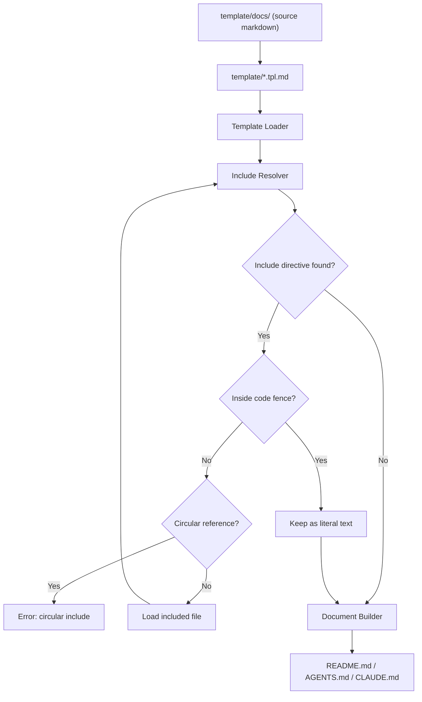
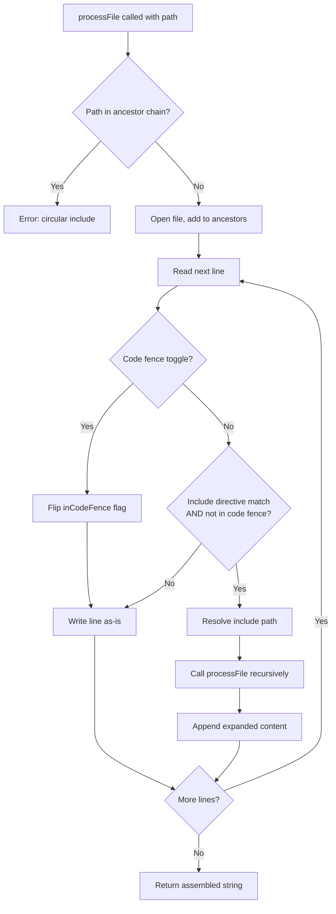

<!--
⚠️ AUTO-GENERATED FILE — DO NOT EDIT - template/README.tpl.md
-->
# docs-ssot

## Overview

`docs-ssot` is a documentation Single Source of Truth (SSOT) generator.

It composes files such as README.md, CLAUDE.md, AGENTS.md, and other AI agent instruction files from small modular Markdown files.

---

## Background

AI-assisted development and AI agents are becoming a standard part of software development workflows.  
Different AI tools and agents require different instruction and context files, for example:

- README.md
- AGENTS.md
- CLAUDE.md
- Agent-specific rule files like `.claude/rules`, `.cursor/rules`
- Development guidelines
- Architecture documentation

As the number of AI tools increases (Claude, Codex, Cursor, etc.), maintaining these files becomes difficult.

Common problems include:

- Documentation duplication
- Inconsistent information across files
- Outdated documentation
- Manual copy & paste maintenance
- Documentation drift over time

Maintaining multiple documentation files without duplication becomes increasingly difficult.

---

## Problem

Documentation should follow the Single Source of Truth (SSOT) principle, but Markdown alone has limited reuse and composition capabilities.

Markdown is easy to write but lacks:

- File composition
- Reusable documentation modules
- Document templating
- Shared sections across multiple documents
- Structured documentation assembly

As a result, teams often duplicate content across multiple Markdown files.

---

## Solution

`docs-ssot` solves this problem by introducing:

- Modular Markdown documentation
- Template-based document structure
- Include directives for Markdown files
- Generated documentation files
- Single Source of Truth documentation architecture

Instead of writing large README files directly, documentation is split into small reusable Markdown modules and assembled into final documents using templates.

---

## Concept

The documentation workflow changes from this:

```
Manually write:

- README.md
- AGENTS.md
- CLAUDE.md
```

To this:

```
Write small docs in docs/
  ↓
Use templates
  ↓
docs-ssot build
  ↓
Generate README.md / AGENTS.md / CLAUDE.md
```

This ensures:

- No duplication
- Consistent documentation
- Easier updates
- Scalable documentation structure
- AI-friendly documentation organization

> **Documentation Site:** <https://hiromaily.github.io/docs-ssot/>

---

## Setup

### Prerequisites

- Go 1.26+
- make

### Install

```sh
go install github.com/hiromaily/docs-ssot/cmd/docs-ssot@latest
```

Or build from source:

```sh
git clone https://github.com/hiromaily/docs-ssot.git
cd docs-ssot
make build
```

The binary is output to `bin/docs-ssot`.

### Quick Start

1. Create source Markdown files under `template/docs/`
2. Create template files under `template/` (e.g., `README.tpl.md`)
3. Define build targets in `docsgen.yaml`:

```yaml
targets:
  - input: template/README.tpl.md
    output: README.md
```

4. Generate documents:

```sh
docs-ssot build
```

### Development Setup

```sh
make install-dev   # Install lefthook and golangci-lint
make build         # Build the binary
make docs          # Generate documentation
make test          # Run tests
```

---

## Features

`docs-ssot` provides a simple documentation generation system based on Markdown includes and templates.

### 1. Markdown Include System

Split large documents into small reusable Markdown files and include them where needed.

Example:

```md
<!-- @include: ../01_project/overview.md -->
```

This allows documentation to be modular and reusable across multiple documents.

### 2. Template-Based Document Structure

Document structure is defined in template files.

For example:

- README.tpl.md
- CLAUDE.tpl.md

Each template defines how documents are composed, while the actual content lives in the docs directory.

### 3. Multiple Output Documents

The same source Markdown files can generate multiple documents:

- README.md (for GitHub)
- AGENTS.md (for AI context)
- CLAUDE.md (for Claude Code context)
- Documentation files
- Internal docs

This enables different audiences to receive different document structures from the same source.

### 4. Single Source of Truth (SSOT)

Each piece of information exists in only one Markdown file.
All final documents are generated from these source files.

This prevents:

- duplicated documentation
- inconsistent information
- outdated README sections

### 5. Recursive Includes

Included Markdown files can themselves include other files, allowing hierarchical document composition.

This enables building large documents from small components.

### 6. Duplicate Detection

The `check` command scans source Markdown files and detects near-duplicate sections using TF-IDF cosine similarity.
This helps identify SSOT violations where the same information has been written in multiple places.

### 7. Docs as Code Workflow

Documentation becomes a build artifact:

```
docs/        → source
template/    → structure
generator    → build tool
README.md    → output
```

This makes documentation maintainable, scalable, and version-controlled like code.

---

## Architecture

### Architecture Overview

The system consists of:

- Generator CLI
- Markdown modules
- Template files

### System Architecture

`docs-ssot` is composed of three main layers:

1. Generator CLI (docs-ssot)
2. Markdown source files (docs/)
3. Template files (template/)

The generator reads template files, resolves include directives, and produces final documents such as `README.md` and `AGENTS.md`, `CLAUDE.md`.

---

#### `docs-ssot` CLI Core Components

Internally, the generator is intentionally simple and built around three core components:

##### 1. Template Loader

Responsible for loading template files.

- Reads template files from the template directory
- Provides template content to the include resolver

Templates define the structure of generated documents.

---

##### 2. Include Resolver

Responsible for resolving include directives.

- Parses include directives
- Loads referenced Markdown files
- Expands includes recursively
- Supports directory and glob includes
- Detects circular includes
- Returns fully expanded Markdown content

This is the core component of the system.

##### 3. Link Path Rewriter

Responsible for rewriting relative links and image URLs in processed files.

- Adjusts link paths to be correct relative to the output file location
- Handles both Markdown links and image references
- Ensures links work regardless of source file depth

---

##### 4. Document Builder

Responsible for generating final output files.

- Receives expanded Markdown content
- Assembles the final document
- Writes output files (e.g., README.md, AGENTS.md, CLAUDE.md)
- Ensures deterministic output

---

#### Components

#### docs/

The docs directory contains the Single Source of Truth Markdown files.
Each file represents a small, reusable piece of documentation.

These files should:

- be small
- be reusable
- contain only one topic
- not depend on document structure

---

#### template/

Template files define document structure.

They do not contain actual documentation content, only structure and include directives.

Examples:

- README.tpl.md
- CLAUDE.tpl.md

Templates decide:

- document order
- document sections
- which content appears in which output

---

#### Generator (docs-ssot)

The generator is a CLI tool that orchestrates the core components:

1. Load template (Template Loader)
2. Resolve includes (Include Resolver)
3. Write output (Document Builder)

#### `docsgen.yaml` Config file

Configuration for input file and output file.

```yaml
targets:
  - input: template/README.tpl.md
    output: README.md

  - input: template/AGENTS.tpl.md
    output: AGENTS.md

  - input: template/CLAUDE.tpl.md
    output: CLAUDE.md
```

---

### Document Build Flow

The document generation flow works like this:



---

#### Design Principles

The system is designed with the following principles:

- Single Source of Truth
- Modular documentation
- Template-based composition
- Generated outputs
- Documentation as code
- Deterministic builds
- Simple implementation
- No heavy static site generator

---

#### Design Philosophy

`docs-ssot` is intentionally minimal.

Instead of implementing a full template engine, the system performs only four operations:

1. Load templates
2. Expand includes (with heading level adjustment)
3. Rewrite relative link paths
4. Write documents

Everything else is handled through Markdown structure and file organization.

---

## Commands Reference

This document describes the available CLI commands for docs-ssot.

### Overview

The CLI provides commands for generating documents from templates and managing documentation sources.

| Command | Description |
|---------|-------------|
| `docs-ssot build` | Generate final documents from templates |
| `docs-ssot check` | Check docs for SSOT violations by detecting near-duplicate sections |
| `docs-ssot include <file>` | Resolve includes and print expanded result to stdout |
| `docs-ssot migrate [files...]` | Decompose existing Markdown files into SSOT section structure |
| `docs-ssot validate` | Validate documentation structure without generating output |
| `docs-ssot version` | Print the build version |

---

### docs build

Generate final documents (e.g., README.md, CLAUDE.md) from templates.

```
docs-ssot build
```

#### What it does

- Reads template files
- Resolves `@include` directives
- Expands included Markdown files
- Writes final generated documents

---

### docs check

Check docs for SSOT violations by detecting near-duplicate sections across Markdown files.

```
docs-ssot check [flags]
```

Uses TF-IDF cosine similarity to compare sections at the specified heading level. Sections scoring above the threshold are reported as potential SSOT violations — places where the same information exists in multiple source files.

#### Flags

| Flag | Default | Description |
|------|---------|-------------|
| `--root` | `docs` | Root directory to scan for Markdown files |
| `--threshold` | `0.82` | Similarity cutoff (0.0–1.0); pairs above this score are reported |
| `--min-chars` | `120` | Minimum character count for a section to be included in comparison |
| `--section-level` | `2` | Heading level used as section boundary (1–6) |
| `--format` | `text` | Output format: `text` or `json` |
| `--exclude` | — | Exclude path pattern (repeatable) |

#### Examples

Basic check with default settings:

```
docs-ssot check
```

Lower threshold to catch more candidates:

```
docs-ssot check --threshold 0.75
```

Compare at H3 level, exclude changelogs, output JSON:

```
docs-ssot check --section-level 3 --exclude docs/changelog/** --format json
```

#### Output

Text output (one block per similar pair):

```
score=0.891
A: docs/auth/overview.md [API > Authentication]
B: docs/setup/login.md [Setup > Authentication]
A title: Authentication
B title: Authentication
A snippet: Authentication tokens must be refreshed before they expire...
B snippet: Access tokens must be renewed prior to expiry...
----------------------------------------------------------------------------------------------------
```

A score of `1.0` means identical content; `0.82` (default threshold) catches near-duplicates while filtering loosely related content.

#### Exit behaviour

Exits `0` whether or not duplicates are found. Use `--format json` and inspect `result_count` in CI pipelines.

---

### docs migrate

Decompose existing monolithic Markdown files (e.g., README.md, CLAUDE.md) into the docs-ssot section structure.

```
docs-ssot migrate [files...] [flags]
```

This is the primary adoption command. It takes existing documentation files and converts them into modular, reusable sections with template files that reproduce the original document structure via `@include` directives.

#### What it does

1. **Splits** each input file by H2 headings into candidate sections
2. **Categorises** sections into directories (`project/`, `development/`, `architecture/`, `reference/`, `product/`, `misc/`) based on heading keyword heuristics
3. **Detects duplicates** across input files using TF-IDF cosine similarity (reuses the `check` command's engine)
4. **Creates section files** under `template/sections/<category>/<slug>.md`
5. **Creates template files** under `template/pages/<name>.tpl.md` with `@include` directives
6. **Creates `docsgen.yaml`** if it does not already exist
7. **Verifies round-trip** by running `build` and comparing output against originals

#### Section categorisation

Sections are assigned to categories based on heading keywords:

| Heading keywords | Category |
|-----------------|----------|
| Architecture, Design, System, Pipeline | `architecture/` |
| Overview, About, Introduction, Background | `project/` |
| Install, Setup, Getting Started, Prerequisites | `development/` |
| Test, Testing, CI | `development/` |
| Lint, Format, Code Quality | `development/` |
| Contributing, Contribute | `development/` |
| API, Commands, CLI, Reference | `reference/` |
| License, Changelog, Roadmap | `project/` |
| FAQ, Troubleshooting | `product/` |
| (fallback) | `misc/` |

#### Duplicate handling

When the same content appears in multiple input files:

1. TF-IDF cosine similarity is computed between all cross-file section pairs
2. Pairs scoring above the threshold are merged into a single section file
3. Both templates reference the shared section via `@include`

#### Flags

| Flag | Default | Description |
|------|---------|-------------|
| `--output-dir` | `template/sections` | Where to write section files |
| `--template-dir` | `template/pages` | Where to write template files |
| `--section-level` | `2` | Heading level used as section boundary (1–6) |
| `--threshold` | `0.82` | Similarity threshold for duplicate detection (0.0–1.0) |
| `--dry-run` | `false` | Print the migration plan without writing files |

#### Examples

Migrate existing README and CLAUDE.md:

```
docs-ssot migrate README.md CLAUDE.md
```

Preview migration plan without writing files:

```
docs-ssot migrate --dry-run README.md CLAUDE.md
```

Lower the duplicate detection threshold:

```
docs-ssot migrate --threshold 0.75 README.md
```

Split at H1 boundaries instead of H2:

```
docs-ssot migrate --section-level 1 README.md
```

#### Output

```
Parsed README.md: 8 sections
Parsed CLAUDE.md: 6 sections
Detected 3 duplicate sections (similarity > 0.82):
  "Architecture Overview" — merged into template/sections/architecture/overview.md (score=0.950)
  "Setup" — merged into template/sections/development/setup.md (score=1.000)
  "Testing" — merged into template/sections/development/testing.md (score=0.891)
Creating 11 unique section files in template/sections
  template/sections/project/overview.md
  template/sections/development/setup.md
  ...
Created template/pages/README.tpl.md (8 includes)
Created template/pages/CLAUDE.tpl.md (6 includes)
Created docsgen.yaml
Verifying round-trip...
Round-trip verification: OK
Migration complete.
```

#### Post-migration workflow

After `migrate`, the user's workflow becomes:

```sh
# Edit source sections
vim template/sections/development/setup.md

# Regenerate all outputs
docs-ssot build

# Verify
git diff README.md CLAUDE.md
```

---

### docs include

Resolve include directives and print the expanded result to stdout.

```
docs-ssot include <file>
```

Example:

```
docs-ssot include template/README.tpl.md
```

Useful for debugging template expansion without writing any output files.

---

### docs validate

Validate documentation structure without generating any output files.

```
docs-ssot validate
```

Performs a dry run over all templates in `docsgen.yaml`.

#### Validation checks

- Missing include files
- Circular includes
- Invalid paths

#### Output

Success:

```
OK
```

Failure (one line per failing template):

```
ERROR: include error (/path/to/file.md): open /path/to/file.md: no such file or directory
```

Exits with a non-zero status code when any error is found.

---

### docs version

Print the build version.

```
docs-ssot version
```

---

### Typical Workflow

```
docs-ssot validate
docs-ssot build
```

Or during development:

```
docs-ssot include template/README.tpl.md
```

---

### Recommended Makefile Shortcuts

```
make docs                                     # generate all output targets
make docs-validate                            # validate all templates
make docs-include FILE=template/README.tpl.md # expand and print a template
make docs-check                               # check docs for SSOT violations (default settings)
make docs-check ARGS="--threshold 0.75"       # check with custom flags
make docs-migrate FILES="README.md CLAUDE.md" # migrate existing docs to SSOT structure
make docs-migrate FILES="README.md" ARGS="--dry-run"  # preview migration plan
make docs-version                             # print the build version
```

---

## Include Specification

This document defines the include directive specification used by `docs-ssot`.

### Overview

The include directive allows Markdown files and templates to include other Markdown files.
Includes are expanded recursively to build final generated documents.

---

### Include Directive Syntax

```
<!-- @include: path [level=<delta>] -->
```

Example:

```
<!-- @include: docs/01_project/overview.md -->
```

The directive must be written inside an HTML comment.

An optional `level` parameter adjusts the heading depth of the included content:

```
<!-- @include: docs/03_architecture/overview.md level=+1 -->
<!-- @include: docs/03_architecture/overview.md level=-1 -->
<!-- @include: docs/03_architecture/overview.md level=+2 -->
```

| Parameter | Meaning |
|-----------|---------|
| `level=+1` | Deepen all headings by one level (`##` → `###`) |
| `level=+2` | Deepen all headings by two levels (`##` → `####`) |
| `level=-1` | Shallow all headings by one level (`###` → `##`) |
| `level=0` | No change (same as omitting the parameter) |

Heading levels are clamped to the valid range `[1, 6]`.
Headings inside fenced code blocks in the included file are not adjusted.

---

### Supported Include Paths

The include directive supports multiple path formats.

#### 1. Single File Include

```
<!-- @include: docs/01_project/overview.md -->
```

Includes a single Markdown file.

#### 2. Directory Include

```
<!-- @include: docs/02_product/ -->
```

Includes all `.md` files in the directory (non-recursive).
Files are included in sorted filename order.
The trailing `/` in the path is required to trigger directory mode.
Subdirectories are skipped; only `.md` files directly in the specified directory are included.

#### 3. Glob Include

```
<!-- @include: docs/02_product/*.md -->
```

Includes all files matching the glob pattern.
Files are included in sorted (lexical) order.
Glob metacharacters (`*`, `?`, `[`) in the path trigger glob mode.
If the pattern matches no files, no content is inserted (no error).
Subdirectories matched by the pattern are skipped; only regular files are included.

---

#### 4. Recursive Glob Include

```
<!-- @include: docs/**/*.md -->
```

Includes all files matching the recursive glob pattern.
`**` matches zero or more path segments, so `docs/**/*.md` matches both `docs/file.md` and `docs/sub/deep/file.md`.
Files are included in sorted (lexical) path order.
If the root directory does not exist or no files match, no content is inserted (no error).
Directories are skipped; only regular files are included.

---

### Include Order

When including multiple files (directory or glob), files are included in alphabetical order.

Recommended file naming:

```
01_overview.md
02_features.md
03_usecases.md
```

This ensures deterministic document structure.

---

### Recursive Includes

Included files may contain include directives themselves.

Example:

```
A.md includes B.md
B.md includes C.md
```

Final expanded document:

```
A + B + C
```

The system expands includes recursively until no include directives remain.

The algorithm used for recursive resolution:



---

### Circular Include Detection

Circular includes are detected and treated as errors.

Example:

```
A.md includes B.md
B.md includes C.md
C.md includes A.md
```

This must result in an error.

---

### Missing File Handling

If an included file does not exist, the generator must return an error and stop the build.

Includes must not fail silently.

---

### Path Rules

- Paths are resolved relative to the file containing the directive
- Only `.md` files can be included
- Include directives must be on their own line
- Includes are expanded before document generation

---

### Summary

Supported include formats:

| Format | Description |
|-------|-------------|
| file.md | Single file |
| dir/ | All markdown files in directory |
| *.md | Glob include |
| **/*.md | Recursive glob include |

Rules:

- Includes are expanded recursively
- Files are included in sorted order
- Circular includes are errors
- Missing files are errors
- Only Markdown files can be included

---

## AI Agent Configuration Landscape (April 2026)

AI coding agents (Claude Code, Codex, Cursor, GitHub Copilot) each require configuration files to understand project context. These files fall into four layers:

### Layer 1 — Persistent Instructions

Files the agent reads every session to understand project rules and architecture.

| Tool | Primary file | Scoped files |
|------|-------------|-------------|
| Claude Code | `CLAUDE.md` | Subdirectory `CLAUDE.md`, `.claude/CLAUDE.md`, `CLAUDE.local.md` |
| Codex | `AGENTS.md` | Nested `AGENTS.md` per directory, `AGENTS.override.md` |
| Cursor | `.cursor/rules/*.mdc` | Per-file via `globs` frontmatter |
| Copilot | `.github/copilot-instructions.md` | `.github/instructions/*.instructions.md`, `AGENTS.md` |

### Layer 2 — Scoped Rules

Topic-specific or path-gated rules that supplement the primary instruction file.

| Tool | Location | Format |
|------|----------|--------|
| Claude Code | `.claude/rules/*.md` | Markdown, optionally path-gated |
| Codex | Nested `AGENTS.md` hierarchy | Markdown, directory-scoped |
| Cursor | `.cursor/rules/*.mdc` | MDC (Markdown + YAML frontmatter) |
| Copilot | `.github/instructions/*.instructions.md` | Markdown + `applyTo` frontmatter |

### Layer 3 — Reusable Workflows (Skills / Commands)

Packaged multi-step procedures the agent invokes on demand or automatically.

| Tool | Skills location | Command location | Trend |
|------|----------------|-----------------|-------|
| Claude Code | `.claude/skills/<name>/SKILL.md` | `.claude/commands/*.md` (legacy) | Commands integrated into skills |
| Codex | `.agents/skills/<name>/SKILL.md` | `~/.codex/prompts/*.md` (deprecated) | Custom prompts deprecated, skills preferred |
| Cursor | `.cursor/skills/<name>/SKILL.md` | Slash commands | Commands migrating to skills |
| Copilot | `.github/skills/<name>/SKILL.md` | `.github/prompts/*.prompt.md` | Prompt files for explicit invocation |

### Layer 4 — Agent Execution Settings

Runtime configuration controlling model selection, permissions, subagents, and external connections.

| Tool | Settings file | Subagents | Hooks |
|------|--------------|-----------|-------|
| Claude Code | `.claude/settings.json` | `.claude/agents/*.md` | Hooks in `settings.json` |
| Codex | `.codex/config.toml` | `.codex/agents/*.toml` | `.codex/hooks.json` |
| Cursor | `.cursor/cli.json` | `.cursor/agents/*.md` | — |
| Copilot | VS Code / GitHub settings | `.github/agents/*.agent.md` | — |

---

### Key Trends

1. **`AGENTS.md` is the de facto cross-tool standard** — supported by Claude, Codex, Cursor, and Copilot
2. **Claude Code has the richest configuration** — skills, agents, commands, memory, hooks, settings
3. **Cursor is evolving from IDE to Agent-first** — rules and commands are migrating to skills
4. **Copilot is GitHub-native** — deeply integrated with issues, PRs, and the `.github/` directory
5. **Skills are converging** — all four tools support `SKILL.md`-based skills with YAML frontmatter
6. **Commands are being deprecated or merged into skills** across all platforms

### Claude Code Hooks

This project uses Claude Code's [hook system](https://docs.anthropic.com/en/docs/claude-code/hooks) to enforce development guardrails at the AI tool level. Hooks are shell scripts that run **before** Claude executes a tool (Edit, Write, Bash), and can block the action if it violates project rules.

#### Hook Overview

| Hook | Matcher | Purpose |
|------|---------|---------|
| `prevent-main-commit.sh` | Bash | Blocks `git commit` and `git push` on `main`/`master` |
| `prevent-main-edit.sh` | Edit, Write | Blocks file edits on `main`/`master` |
| `prevent-generated-edit.sh` | Edit, Write | Blocks edits to auto-generated files |

#### How It Works

Hooks are configured in `.claude/settings.json` under `hooks.PreToolUse`. Each hook receives the tool input as the `$TOOL_INPUT` environment variable (JSON) and controls execution via exit codes:

| Exit Code | Behavior |
|-----------|----------|
| `0` | Allow — tool execution proceeds |
| `2` | Block — tool execution is rejected, stderr message shown to user |

#### SSOT Protection: prevent-generated-edit.sh

The most notable hook enforces the SSOT principle by preventing Claude from directly editing generated files. It reads `docsgen.yaml` at runtime to build the list of protected files:

```sh
# Extract output paths from docsgen.yaml
GENERATED=$(yq -r '.targets[].output' docsgen.yaml)

# Block if the target file matches any generated output
for gen in $GENERATED; do
  if [ "$REL_PATH" = "$gen" ]; then
    echo "BLOCKED: '$gen' is auto-generated. Edit template/ instead." >&2
    exit 2
  fi
done
```

This means the protection list stays in sync with `docsgen.yaml` automatically — no hardcoded file lists to maintain.

When blocked, Claude sees a message like:

```
BLOCKED: 'README.md' is auto-generated by docs-ssot.
Edit the source in template/ instead, then run 'make docs'.
```

#### Branch Protection: prevent-main-edit.sh / prevent-main-commit.sh

These hooks enforce GitHub Flow by preventing any file modifications or git commits directly on `main` or `master`. Claude is forced to create a feature branch first.

#### Adding New Hooks

1. Create a shell script in `.claude/hooks/`:
   ```sh
   #!/bin/sh
   # Your validation logic here
   # Exit 0 to allow, exit 2 to block (message via stderr)
   ```
2. Make it executable: `chmod +x .claude/hooks/your-hook.sh`
3. Register it in `.claude/settings.json`:
   ```json
   {
     "matcher": "Edit",
     "hooks": [
       { "type": "command", "command": ".claude/hooks/your-hook.sh" }
     ]
   }
   ```

---

<!-- Status legend:
- (Released): Tagged and released.
- (Ready for Release): Implemented but not yet tagged; planned for release once all WIP items are complete.
- No status: Planned for implementation.
-->

## Roadmap

### v0.1 (Released)

- Single file include directive (`<!-- @include: path -->`)
- Recursive include resolution (included files may themselves contain include directives)
- Circular include detection (circular references produce a build error)
- Code fence passthrough (include directives inside fenced code blocks are treated as literal text)
- Multiple output targets via `docsgen.yaml`
- README, CLAUDE.md, AGENTS.md generation
- Link path rewriting — relative links and image URLs in all processed files are rewritten to be correct relative to the output file location

### v0.2 (Release)

- Heading level adjustment — optional `level=±N` parameter on include directives shifts the heading depth of included content (e.g. `<!-- @include: file.md level=+1 -->`)
- Directory include (`<!-- @include: docs/dir/ -->`) — include all `.md` files in a directory (sorted by filename)
- Glob include (`<!-- @include: docs/*.md -->`) — include files matching a glob pattern
- Recursive glob include (`<!-- @include: docs/**/*.md -->`) — include files matching a recursive glob; `**` matches zero or more path segments

### v0.3 (Release)

- `validate` command — dry-run over all templates; reports unresolvable includes without writing output files; exits non-zero on failure
- `include` command — expand includes in a given file and print to stdout (debugging tool)
- `version` command — print the build version

### v0.4

- ssot validator

### v0.5

- Diff / up-to-date check — exit non-zero if generated files differ from committed versions (CI use)
- Dry-run mode — preview changes without writing output files
- ~~Watch mode — automatically rebuild on source file changes~~
- Variable substitution — allow `{{ variable }}` placeholders expanded at build time
- Front matter support — parse and strip/merge YAML front matter from included files
- Conditional includes — include or exclude sections based on build-time flags

### v0.6

- HTML output — convert generated Markdown to HTML
- PDF output — convert generated Markdown to PDF
- TOC generation — automatically insert a table of contents

---

## Feature Status

This document is the single source of truth for the feature roadmap and implementation status of `docs-ssot`.
Other architecture documents should reference this file rather than duplicating status information.

### Include Resolver Features

| Feature | Status | Notes |
|---------|--------|-------|
| Single file include | Implemented | `<!-- @include: path/to/file.md -->` |
| Recursive include | Implemented | Included files may themselves contain include directives |
| Circular include detection | Implemented | Circular references produce a build error |
| Missing file error | Implemented | Missing included file stops the build with an error |
| Code fence passthrough | Implemented | Include directives inside fenced code blocks are treated as literal text |
| Directory include | Implemented | Include all `.md` files in a directory (sorted by filename); trailing `/` in path triggers directory mode |
| Glob include | Implemented | Include files matching a glob pattern (e.g. `*.md`); glob metacharacters (`*`, `?`, `[`) in path trigger glob mode |
| Recursive glob include | Implemented | Include files matching a recursive glob (e.g. `**/*.md`); `**` matches zero or more path segments |
| Link path rewriting | Implemented | Relative links and image URLs in all files are rewritten to be correct relative to the output file location |
| Heading level adjustment | Implemented | Optional `level=±N` parameter on include directives shifts heading depth of included content |
| Include from URL | Planned | Fetch and include a remote Markdown file |

### Generator Features

| Feature | Status | Notes |
|---------|--------|-------|
| Multiple output targets | Implemented | One `docsgen.yaml` can define many template → output pairs |
| Template-based generation | Implemented | Templates in `template/` define output structure |
| Deterministic output | Implemented | Same input always produces identical output |
| Variable substitution | Planned | Allow `{{ variable }}` placeholders expanded at build time |
| Conditional includes | Planned | Include or exclude sections based on build-time flags |
| Front matter support | Planned | Parse and strip/merge YAML front matter from included files |

### CLI and Workflow Features

| Feature | Status | Notes |
|---------|--------|-------|
| `build` command | Implemented | Generates all output targets defined in `docsgen.yaml` |
| `check` command | Implemented | Scans docs for near-duplicate sections using TF-IDF cosine similarity; reports potential SSOT violations |
| `include` command | Implemented | Expands includes in a file and prints the result to stdout; useful for debugging |
| `validate` command | Implemented | Dry-run over all templates; reports unresolvable includes without writing any output files |
| `version` command | Implemented | Prints the build version |
| `migrate` command | Implemented | Decomposes existing Markdown files into SSOT section structure with duplicate detection and round-trip verification |
| Watch mode | Planned | Automatically rebuild on source file changes |
| Dry-run mode | Planned | Preview changes without writing output files |
| Diff / up-to-date check | Planned | Exit non-zero if generated files differ from committed versions (useful for CI) |
| Custom config file path | Planned | Allow specifying a non-default config file via CLI flag |

### Output Header Features

| Feature | Status | Notes |
|---------|--------|-------|
| Auto-generated file header | Planned | Prepend a `<!-- ⚠️ AUTO-GENERATED FILE — DO NOT EDIT -->` banner to all generated files |

### Output Format Features

| Feature | Status | Notes |
|---------|--------|-------|
| Markdown output | Implemented | Generated files are standard Markdown |
| HTML output | Planned | Convert generated Markdown to HTML |
| PDF output | Planned | Convert generated Markdown to PDF |

---

## License

MIT
