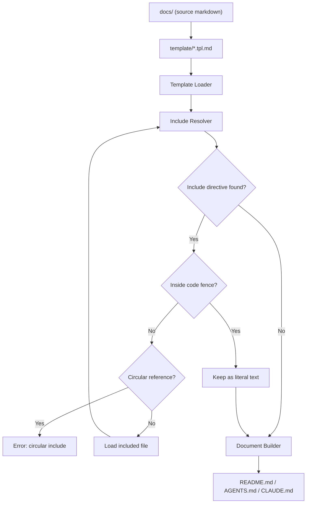

<!-- template/README.tpl.md -->
<!--
⚠️ AUTO-GENERATED FILE — DO NOT EDIT
-->
# docs-ssot

## Overview

`docs-ssot` is a documentation Single Source of Truth (SSOT) generator.

It composes files such as README.md, CLAUDE.md, AGENTS.md, and other AI agent instruction files from small modular Markdown files.

---

## Background

AI-assisted development and AI agents are becoming a standard part of software development workflows.  
Different AI tools and agents require different instruction and context files, for example:

- README.md
- AGENTS.md
- CLAUDE.md
- Agent-specific rule files like `.claude/rules`, `.cursor/rules`
- Development guidelines
- Architecture documentation

As the number of AI tools increases (Claude, Codex, Cursor, etc.), maintaining these files becomes difficult.

Common problems include:

- Documentation duplication
- Inconsistent information across files
- Outdated documentation
- Manual copy & paste maintenance
- Documentation drift over time

Maintaining multiple documentation files without duplication becomes increasingly difficult.

---

## Problem

Documentation should follow the Single Source of Truth (SSOT) principle, but Markdown alone has limited reuse and composition capabilities.

Markdown is easy to write but lacks:

- File composition
- Reusable documentation modules
- Document templating
- Shared sections across multiple documents
- Structured documentation assembly

As a result, teams often duplicate content across multiple Markdown files.

---

## Solution

`docs-ssot` solves this problem by introducing:

- Modular Markdown documentation
- Template-based document structure
- Include directives for Markdown files
- Generated documentation files
- Single Source of Truth documentation architecture

Instead of writing large README files directly, documentation is split into small reusable Markdown modules and assembled into final documents using templates.

---

## Concept

The documentation workflow changes from this:

```
Manually write:

- README.md
- AGENTS.md
- CLAUDE.md
```

To this:

```
Write small docs in docs/
  ↓
Use templates
  ↓
docs-ssot build
  ↓
Generate README.md / AGENTS.md / CLAUDE.md
```

This ensures:

- No duplication
- Consistent documentation
- Easier updates
- Scalable documentation structure
- AI-friendly documentation organization

## Vision

Documentation should be treated as a system, not as static files.

In many projects, documentation becomes fragmented, duplicated, and inconsistent.
The same information is rewritten across README files, design documents, and internal notes.

`docs-ssot` aims to solve this by applying the **Single Source of Truth (SSOT)** principle to Markdown documentation.

### Core Ideas

- **Write once, reuse everywhere**
  - Each piece of information exists in exactly one place
  - Reused via includes across multiple documents

- **Modular documentation**
  - Split documentation into small, composable Markdown files
  - Treat each file as a reusable unit

- **Docs as Code**
  - Documentation follows the same principles as software:
    - modularity
    - composition
    - build pipelines

- **Generated outputs**
  - Final documents (README, AGENTS.md, CLAUDE.md, etc.) are build artifacts
  - Never edited manually

### Why this matters

Without SSOT:

- Documentation diverges
- Updates are error-prone
- Context is duplicated and inconsistent

With `docs-ssot`:

- Documentation stays consistent
- Changes propagate automatically
- Different audiences (users, developers, AI) get tailored outputs from the same source

### Goal

To build a lightweight documentation system where:

- Markdown is the source of truth
- Templates define structure
- A generator composes final documents

Turning documentation into a **maintainable, scalable system**.

---

## Product

## Concept

Instead of maintaining large README files, this project splits documents into
small reusable markdown modules and composes them into final documents.

## Features

`docs-ssot` provides a simple documentation generation system based on Markdown includes and templates.

### 1. Markdown Include System

Split large documents into small reusable Markdown files and include them where needed.

Example:

```md
<!-- @include: ../01_project/overview.md -->
```

This allows documentation to be modular and reusable across multiple documents.

### 2. Template-Based Document Structure

Document structure is defined in template files.

For example:

- README.tpl.md
- CLAUDE.tpl.md

Each template defines how documents are composed, while the actual content lives in the docs directory.

### 3. Multiple Output Documents

The same source Markdown files can generate multiple documents:

- README.md (for GitHub)
- AGENTS.md (for AI context)
- CLAUDE.md (for Claude Code context)
- Documentation files
- Internal docs

This enables different audiences to receive different document structures from the same source.

### 4. Single Source of Truth (SSOT)

Each piece of information exists in only one Markdown file.
All final documents are generated from these source files.

This prevents:

- duplicated documentation
- inconsistent information
- outdated README sections

### 5. Recursive Includes (Planning)

Included Markdown files can themselves include other files, allowing hierarchical document composition.

This enables building large documents from small components.

### 6. Docs as Code Workflow

Documentation becomes a build artifact:

```
docs/        → source
template/    → structure
generator    → build tool
README.md    → output
```

This makes documentation maintainable, scalable, and version-controlled like code.

---

## Architecture

## Architecture Overview

The system consists of:

- Generator CLI
- Markdown modules
- Template files

## System Architecture

`docs-ssot` is composed of three main layers:

1. Generator CLI (docs-ssot)
2. Markdown source files (docs/)
3. Template files (template/)

The generator reads template files, resolves include directives, and produces final documents such as `README.md` and `AGENTS.md`, `CLAUDE.md`.

---

### `docs-ssot` CLI Core Components

Internally, the generator is intentionally simple and built around three core components:

#### 1. Template Loader

Responsible for loading template files.

- Reads template files from the template directory
- Provides template content to the include resolver

Templates define the structure of generated documents.

---

#### 2. Include Resolver

Responsible for resolving include directives.

- Parses include directives
- Loads referenced Markdown files
- Expands includes recursively
- Supports directory and glob includes
- Detects circular includes
- Returns fully expanded Markdown content

This is the core component of the system.

#### 3. Link Path Resolver (Planning)

---

#### 4. Document Builder

Responsible for generating final output files.

- Receives expanded Markdown content
- Assembles the final document
- Writes output files (e.g., README.md, AGENTS.md, CLAUDE.md)
- Ensures deterministic output

---

### Components

### docs/

The docs directory contains the Single Source of Truth Markdown files.
Each file represents a small, reusable piece of documentation.

These files should:

- be small
- be reusable
- contain only one topic
- not depend on document structure

---

### template/

Template files define document structure.

They do not contain actual documentation content, only structure and include directives.

Examples:

- README.tpl.md
- CLAUDE.tpl.md

Templates decide:

- document order
- document sections
- which content appears in which output

---

### Generator (docs-ssot)

The generator is a CLI tool that orchestrates the core components:

1. Load template (Template Loader)
2. Resolve includes (Include Resolver)
3. Write output (Document Builder)

### `docsgen.yaml` Config file

Configuration for input file and output file.

```yaml
targets:
  - input: template/README.tpl.md
    output: README.md

- input: template/AGENTS.tpl.md
    output: AGENTS.md

  - input: template/CLAUDE.tpl.md
    output: CLAUDE.md
```

---

## Document Build Flow

The document generation flow works like this:



---

### Design Principles

The system is designed with the following principles:

- Single Source of Truth
- Modular documentation
- Template-based composition
- Generated outputs
- Documentation as code
- Deterministic builds
- Simple implementation
- No heavy static site generator

---

### Design Philosophy

`docs-ssot` is intentionally minimal.

Instead of implementing a full template engine, the system performs only four operations:

1. Load templates
2. Expand includes
3. resolve link path
4. Write documents

Everything else is handled through Markdown structure and file organization.

---

## Development

### Setup

```sh
make build
make docs
```

---

## AI

### AI Context

This repository uses docs-ssot, a documentation single source of truth system.

All documentation is written as small modular Markdown files under the `docs/` directory.
Final documents such as README.md and CLAUDE.md are generated from template files.

### How Documentation Works

Documentation is built using three main parts:

1. docs/ (Markdown source files)
2. template/ (document structure)
3. generator (include resolver and builder)

The generator reads template files and expands include directives like:

```

<!-- @include: ../01_project/overview.md -->

```

Included files may also include other files (recursive includes).

### Important Rules

When editing documentation:

- Do NOT edit README.md directly
- Do NOT edit CLAUDE.md directly
- Edit files under docs/ instead
- Templates define document structure
- docs directory contains the source of truth

### Directory Roles

```

docs/       → documentation source (SSOT)
template/   → document templates
internal/   → generator implementation
cmd/        → CLI entrypoint
README.md   → generated output
CLAUDE.md   → generated output for AI context

```

### Documentation Philosophy

This project follows these principles:

- Single Source of Truth
- Modular documentation
- Documentation as Code
- Generated documents
- Reusable Markdown modules
- Template-based composition

## Reference

# Commands Reference

This document describes the available CLI commands for docs-ssot.

## Overview

The CLI provides commands for generating documents from templates and managing documentation sources.

---

## docs build

Generate final documents (e.g., README.md, CLAUDE.md) from templates.

```
docs-ssot build
```

### What it does

- Reads template files
- Resolves `@include` directives
- Expands included Markdown files
- Writes final generated documents

---

## docs include

Resolve include directives and print the expanded result to stdout.

```
docs-ssot include <file>
```

Example:

```
docs-ssot include template/README.tpl.md
```

Useful for debugging template expansion without writing any output files.

---

## docs validate

Validate documentation structure without generating any output files.

```
docs-ssot validate
```

Performs a dry run over all templates in `docsgen.yaml`.

### Validation checks

- Missing include files
- Circular includes
- Invalid paths

### Output

Success:

```
OK
```

Failure (one line per failing template):

```
ERROR: include error (/path/to/file.md): open /path/to/file.md: no such file or directory
```

Exits with a non-zero status code when any error is found.

---

## docs version

Print the build version.

```
docs-ssot version
```

---

## Typical Workflow

```
docs-ssot validate
docs-ssot build
```

Or during development:

```
docs-ssot include template/README.tpl.md
```

---

## Recommended Makefile Shortcuts

```
make docs                                     # generate all output targets
make docs-validate                            # validate all templates
make docs-include FILE=template/README.tpl.md # expand and print a template
```
