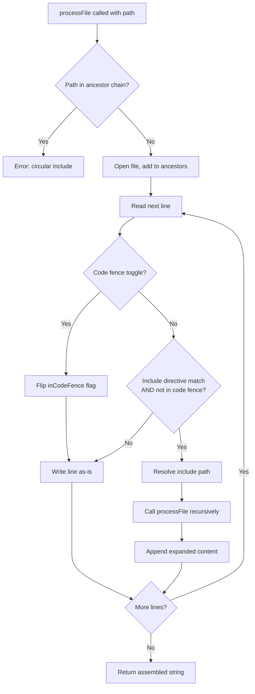

```mermaid
flowchart TD
    A[processFile called with path] --> B{Path in ancestor chain?}
    B -- Yes --> C[Error: circular include]
    B -- No --> D[Open file, add to ancestors]
    D --> E[Read next line]
    E --> F{Code fence toggle?}
    F -- Yes --> G[Flip inCodeFence flag]
    G --> H[Write line as-is]
    F -- No --> I{Include directive match\nAND not in code fence?}
    I -- No --> H
    I -- Yes --> J[Resolve include path]
    J --> K[Call processFile recursively]
    K --> L[Append expanded content]
    L --> M{More lines?}
    H --> M
    M -- Yes --> E
    M -- No --> N[Return assembled string]
```
