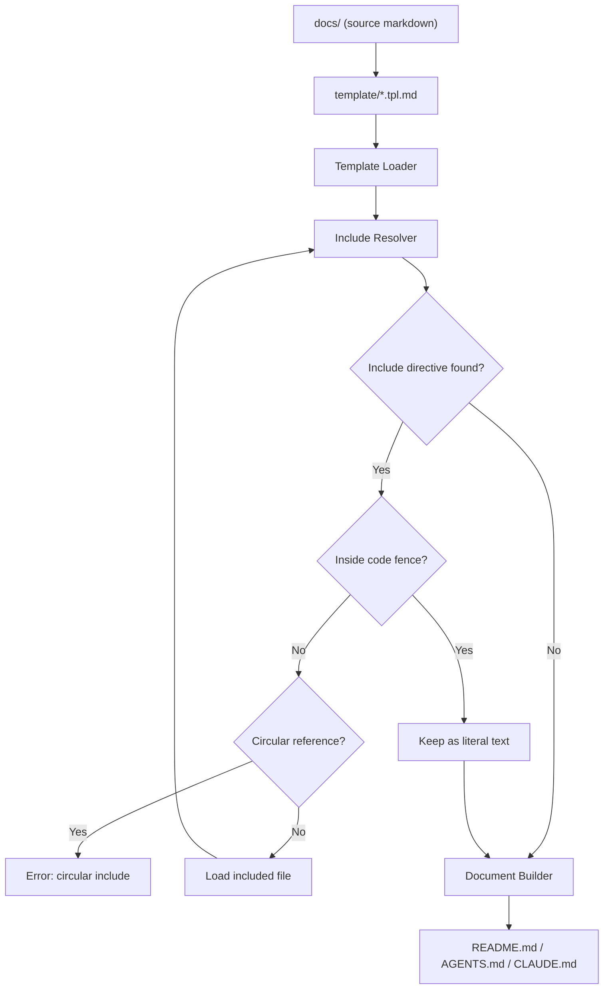

```mermaid
flowchart TD
    A["docs/ (source markdown)"] --> B["template/*.tpl.md"]
    B --> C[Template Loader]
    C --> D[Include Resolver]
    D --> E{Include directive found?}
    E -- Yes --> F{Inside code fence?}
    F -- Yes --> G[Keep as literal text]
    F -- No --> H{Circular reference?}
    H -- Yes --> I[Error: circular include]
    H -- No --> J[Load included file]
    J --> D
    E -- No --> K[Document Builder]
    G --> K
    K --> L["README.md / AGENTS.md / CLAUDE.md"]
```
